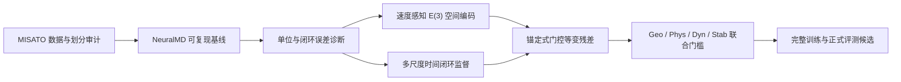

# Protein-Quanta：面向蛋白质—配体长时程动力学预测的可控等变学习

> **文档属性：初赛提交内部参考底稿（v0.1，禁止直接提交）**  
> **适用赛道：GOAI AI for Research 算法赛｜方向二**  
> **证据截止：2026-08-14；对应代码提交：`ae16cbb`**  
> **维护原则：只写已核验事实；代理实验不得写成三维正式成绩；计划不得写成已有成果。**

## 重要使用说明

最新初赛模板明确要求参赛者独立完成并禁止使用 AI 作答。因此，本文件不是可直接上传的参赛答案，而是供团队内部核对事实、组织证据和讨论结构的参考底稿。正式提交前，三位成员必须：

1. 独立阅读最新指导手册与模板；
2. 对照仓库中的原始实验报告和机器可读结果复核所有数字；
3. 用团队自己的理解重新组织、取舍并撰写正文；
4. 对项目名称、成员信息、奖项表述、开源许可和提交格式作最终人工确认；
5. 删除本说明、所有状态标签、写作提示与未完成占位符。

本文使用四类状态标签：

- **[已验证]**：有代码、机器结果或审计报告支持，可在人工复核后引用；
- **[代理证据]**：只在低维或小规模代理任务中成立，不能写成正式三维提升；
- **[进行中]**：实验设计或实现已存在，但尚无足够效应证据；
- **[待人工确认]**：必须由团队或赛事官方确认后才能写入最终稿。

---

## 目录

- [0. 提交前必读与版本信息](#0-提交前必读与版本信息)
- [1. 项目概述](#1-项目概述)
  - [1.1 项目名称](#11-项目名称)
  - [1.2 参赛方向](#12-参赛方向)
  - [1.3 方案概述](#13-方案概述)
- [2. 科学问题理解](#2-科学问题理解)
  - [2.1 科学问题与研究对象](#21-科学问题与研究对象)
  - [2.2 科学意义](#22-科学意义)
  - [2.3 核心科学与工程挑战](#23-核心科学与工程挑战)
- [3. 技术方案与预期方法路线](#3-技术方案与预期方法路线)
  - [3.1 总体技术方案](#31-总体技术方案)
  - [3.2 预期方法路线](#32-预期方法路线)
  - [3.3 数据来源依赖工具与运行流程](#33-数据来源依赖工具与运行流程)
  - [3.4 外部预训练模型与数据合规边界](#34-外部预训练模型与数据合规边界)
  - [3.5 评估协议与模型晋升门槛](#35-评估协议与模型晋升门槛)
- [4. 阶段性实验结果或可行性验证](#4-阶段性实验结果或可行性验证)
  - [4.1 阶段性实验与复现结果](#41-阶段性实验与复现结果)
  - [4.2 当前结果与关键决策](#42-当前结果与关键决策)
  - [4.3 创新构思的初期验证](#43-创新构思的初期验证)
  - [4.4 结果边界与当前不足](#44-结果边界与当前不足)
- [5. 复现与开放计划](#5-复现与开放计划)
  - [5.1 复现方式](#51-复现方式)
  - [5.2 开源计划](#52-开源计划)
  - [5.3 依赖数据与合规说明](#53-依赖数据与合规说明)
- [6. 团队介绍](#6-团队介绍)
  - [6.1 成员背景与能力](#61-成员背景与能力)
  - [6.2 团队分工](#62-团队分工)
  - [6.3 已有成果](#63-已有成果)
- [7. 初赛前更新清单](#7-初赛前更新清单)
- [附录 A：模板字段映射](#附录-a模板字段映射)
- [附录 B：可用与禁用表述](#附录-b可用与禁用表述)
- [附录 C：内部证据索引](#附录-c内部证据索引)
- [附录 D：人工重写与终审清单](#附录-d人工重写与终审清单)
- [附录 E：版本更新记录](#附录-e版本更新记录)

---

## 0. 提交前必读与版本信息

| 项目 | 当前信息 |
|---|---|
| 内部版本 | v0.1 |
| 证据截止日期 | 2026-08-14 |
| 代码证据点 | `ae16cbb`（`codex/reproduction-bootstrap` 分支） |
| 项目仓库 | <https://github.com/ytq0198/Protein-Quanta> |
| 对应模板 | 《AI for Research赛道｜算法赛初赛方案大纲》最新版本 |
| 参赛方向 | 算法赛方向二：虚拟细胞相关的蛋白质—配体动力学轨迹预测 |
| 当前主基线 | Published NeuralMD |
| 当前创新状态 | Control-anchored gated E(3) residual 已通过正确性门槛，效应门槛尚未完成 |
| 官方总分 | **不可填写**：新版材料未公开足以复算的完整精确权重与正式评测器 |
| 正式稿责任 | 三位成员共同核验、独立重写并签字确认 |

**推荐的事实更新流程：**新实验完成后，先生成机器结果，再写复现报告，然后更新 `current-valid-evidence-2026-08-14.md`，最后才更新本底稿。任何只存在于聊天记录、训练日志片段或未经复算表格中的数字均不得进入正式稿。

---

## 1. 项目概述

### 1.1 项目名称

**推荐名称（需团队独立决定）：**

> Protein-Quanta：面向蛋白质—配体长时程动力学预测的可控等变学习

**备选名称：**

- Protein-Quanta：融合时空等变性与多尺度闭环监督的配体轨迹预测
- Protein-Quanta：面向长时程分子动力学的锚定式等变残差模型
- Protein-Quanta：小数据条件下蛋白质—配体动力学的稳定外推方法

**[待人工确认]** 最终名称应在“科学问题”“核心技术”和“当前证据”三者之间保持一致。在 anchored residual 尚未通过效应门槛前，不建议在标题中使用“高精度”“突破性”或“超越基线”等结果性措辞。

### 1.2 参赛方向

算法赛方向二。团队研究对象为半柔性设定下的蛋白质—配体动力学预测：固定蛋白质环境，利用已观测的配体原子坐标序列，预测其后续三维坐标轨迹。

根据最新版指导材料，核心场景包括：

| 场景 | 观测帧数 | 预测帧数 | 主要难点 |
|---|---:|---:|---|
| T1 | 10 | 10 | 短历史下的短期动力学估计 |
| T2 | 80 | 20 | 长历史条件下的局部精细预测 |
| T3 | 20 | 80 | 短历史条件下的长时程闭环外推与漂移控制 |

### 1.3 方案概述

> **以下为参考要点，不是可直接提交的正文。团队应基于自身理解独立重写。**

本项目拟建立一条从可复现基线到长时程稳定创新模型的研究路线。首先，以 NeuralMD 和 MISATO 为基础复现实验对象，完成数据完整性、单位一致性、场景协议和代码可复现性审计；其次，将三维刚体对称性、速度信息和多时间尺度闭环监督纳入同一建模框架；最后，以已复现的稳定控制模型为锚点，学习零初始化、受门控的 E(3) 等变残差，使新模型在训练初期不破坏基线输出，并通过坐标精度、轨迹幅度、动力学稳定性和残差能量共同约束长时程行为。

当前阶段已经形成三类证据：其一，完整 MISATO 文件、官方划分与流式训练链路已经通过一致性检查；其二，多尺度闭环监督在 12 维时序代理任务上显示了改善 T3 长时程误差的稳定信号；其三，锚定式等变残差在真实复合物上通过了可微性、等变性和安全初始化测试。与此同时，速度感知模型、稀疏邻域和强阻尼方案暴露出轨迹幅度坍缩、坐标误差恶化或吞吐下降等问题，已被如实记录并停止晋升。

项目的核心研究假设是：**长时程误差不能只依靠更大的序列模型解决；需要同时满足几何对称性、物理单位一致性、闭环训练目标和对稳定基线的受控修正。**

---

## 2. 科学问题理解

### 2.1 科学问题与研究对象

蛋白质—配体体系的分子动力学轨迹反映了配体在结合口袋中的构象变化、局部相互作用和动态稳定性。传统分子动力学模拟通常需要在很小的时间步长上反复计算相互作用，长时间轨迹的计算成本较高。数据驱动方法希望学习由历史状态到未来状态的近似动力学演化规律，从而降低轨迹推演成本。

本题不是一般的视频外推或坐标回归。预测对象具有以下结构：

- 每个样本包含数量可变、类型不同的配体原子；
- 原子坐标处于三维欧氏空间，模型输出应满足平移、旋转与反射下的合理变换规律；
- 蛋白质口袋提供条件环境，但在半柔性设定中蛋白质坐标保持固定；
- 推演采用闭环方式时，前一步误差会进入下一步输入并持续累积；
- 仅降低坐标 RMSE 可能通过“趋向静止”获得表面收益，却损害真实的运动幅度和动力学分布。

因此，本项目把任务理解为一个受几何对称性和动力学约束的条件长序列外推问题，而非单一的逐帧监督学习问题。

### 2.2 科学意义

该问题具有两条相互关联的价值线：

1. **AI for Science 方法价值。** 探索等变几何学习、长序列建模、闭环稳定性和物理一致性如何在小样本三维动力学任务中协同工作，而不是仅依赖模型规模。
2. **药物研究潜在价值。** 更快速地近似蛋白质—配体的动态行为，有望为结合稳定性分析、候选构象筛选和后续高精度模拟提供辅助信息。当前项目只研究轨迹预测方法，不把尚未验证的轨迹指标直接等同于药效或亲和力结论。

从科研角度，本项目特别关注一个可检验问题：当模型在长时程 T3 场景中出现漂移或运动坍缩时，主要瓶颈究竟来自时间表示、空间等变归纳偏置、数值单位、训练目标，还是闭环误差传播？项目通过逐层对照实验拆分这些因素。

### 2.3 核心科学与工程挑战

| 挑战 | 具体表现 | 本项目的应对思路 |
|---|---|---|
| 长时程误差累积 | T3 需要由 20 帧推演 80 帧，闭环误差逐步放大 | 多尺度 rollout horizon、闭环训练和分场景评估 |
| 几何对称性 | 任意旋转或平移不应改变内在动力学结论 | E(3) 等变坐标更新与严格变换测试 |
| 动态幅度坍缩 | 静态或强阻尼预测可能获得较低局部误差 | 同时监测坐标误差、步幅比、裁剪率和残差能量 |
| 时间与速度单位 | 帧间速度、ODE 时间和坐标尺度不一致会导致近静态输出 | 解析零加速度控制与单位一致性测试 |
| 数据量与泄漏 | 数据有限；同源蛋白或相似配体可能导致乐观估计 | 严格限定 train-only 开发；补充同源与 scaffold 审计 |
| 算力与吞吐 | 长轨迹、可变原子数和图计算增加训练成本 | HDF5 流式读取、GPU 烟雾测试、稀疏化实测后再决策 |
| 多目标评估 | 几何、物理、动力学和稳定性可能相互冲突 | 禁止用单一 RMSE 宣布晋升，设置联合门槛 |

---

## 3. 技术方案与预期方法路线

### 3.1 总体技术方案

> **参考框架，正式稿需由团队重新表述并解释为何作出这些选择。**

项目采用“审计—复现—诊断—受控创新—联合验证”的路线，而非一次性训练大模型：

技术方案由五个相互约束的模块构成：

1. **数据与协议层。** 以官方 MISATO 数据和最新 T1/T2/T3 定义为唯一正式口径；数据加载时保留复合物 ID、原子类型、坐标和拓扑信息，记录过滤规则与划分清单。
2. **可复现控制层。** 固定 NeuralMD 上游版本、官方检查点和评估场景，将其作为当前主基线与安全锚点。
3. **几何—时间表示层。** 空间上采用 E(3) 等变的相对坐标与速度特征；时间上比较循环网络、Transformer/RoPE 与多尺度闭环目标，但只晋升同时满足三维正确性和效应门槛的方案。
4. **锚定式创新层。** 冻结稳定控制模型，新增可学习的等变残差分支，并以零初始化门控系数控制残差强度。初始输出与控制模型严格一致，训练只允许在证据支持时逐渐偏离锚点。
5. **联合评估层。** 评估不只看坐标误差，还检查轨迹幅度、速度分布、碰撞或几何异常、裁剪率、跨场景稳定性和等变误差。

### 3.2 预期方法路线

#### 阶段 A：复现与协议锁定

- 固定 NeuralMD、MISATO 和官方 checkpoint 的版本与校验值；
- 按最新版 T1/T2/T3 重新评估 published baseline；
- 审计数据文件完整性、原始 split 并集、去多肽过滤和有限坐标；
- 建立每次实验的 manifest、随机种子、配置、环境和机器结果。

#### 阶段 B：瓶颈诊断

- 用解析零加速度模型检查初速度与时间尺度；
- 分别诊断位置-only、速度-aware、不同闭环 horizon 的误差来源；
- 同时记录 T1/T2/T3 坐标 RMSE、轨迹步幅比、裁剪率和数值稳定性；
- 对失败方案执行停止规则，避免在已暴露的内部诊断集上反复调参。

#### 阶段 C：空间与时间建模

- **空间分支：**局部相对几何、原子类型与速度不变量进入消息传递网络，输出 E(3) 等变坐标或加速度修正；
- **时间分支：**使用覆盖 5/10/20/40 步的多尺度 rollout loss，使训练 horizon 更接近 T3 的长时程需求；
- **序列架构比较：**RNN/LSTM/GRU、causal Transformer 和 RoPE 作为时序候选，先在固定协议的代理或小规模实验中筛选，再进行三维效应验证；
- **预训练迁移：**PVB、EPT、DPLM、ProTDyn 等仅作为架构与表示参考；在训练数据 ID、同源关系和许可证未审计前，不加载其权重进入正式候选。

#### 阶段 D：锚定式门控等变残差

设控制模型的预测为 \(\hat{x}^{ctrl}_{t+1}\)，等变残差分支为 \(r_\theta\)，门控尺度为 \(\alpha\)，则候选输出可写为：

\[
\hat{x}_{t+1}=\hat{x}^{ctrl}_{t+1}+\alpha\,r_\theta(x_{\le t},v_{\le t},c),
\]

其中 \(c\) 表示蛋白质口袋条件。初始化令 \(\alpha=0\)，并冻结控制模型，使候选在训练起点与已复现基线完全一致。训练目标由以下部分构成：

- 多场景坐标误差；
- 多尺度闭环误差；
- 轨迹幅度/速度分布约束；
- 残差能量或修正幅度正则；
- 必要的几何或碰撞代理约束。

该设计针对此前实验揭示的矛盾：自由训练的速度感知模型虽然可大幅降低小规模 RMSE，却可能通过强裁剪和运动坍缩取得表面优势；锚定式结构要求模型从安全控制开始，仅学习有证据支持的有限修正。

#### 阶段 E：模型晋升与冻结

每个候选依次通过：

1. 单元测试与数值有限性；
2. 平移、旋转、反射等变性；
3. train-only 小规模效应门槛；
4. 冻结诊断集一次性复算；
5. 完整训练、严格同源/scaffold 审计；
6. 官方允许范围内的正式评估。

任一候选若只改善一个指标但显著损害运动幅度、稳定性或计算效率，则不晋升。

### 3.3 数据来源、依赖工具与运行流程

#### 数据来源

- **MISATO `MD.hdf5`：**当前本地完整文件为 132,841,014,019 字节，MD5 为 `9bc6446922cd80e0f2f3f69349bf88ed`；HDF5 中包含 16,972 个复合物组。
- **官方原始划分：**HDF5 group ID 集与 train/validation/test 三份原始 split 的 ID 并集完全一致。
- **去多肽过滤后规模：**train 13,066、validation 1,357、public test 1,357。
- **使用边界：**当前新模型开发只使用 train 内部划分；validation/test 不用于最新机制的调参。

#### 主要工具与环境

| 类别 | 当前环境 |
|---|---|
| 操作系统 | Ubuntu 22.04.5 LTS |
| Python | 3.10.20 |
| 深度学习框架 | PyTorch 2.6.0+cu124 |
| CUDA | 12.4 |
| 图学习库 | PyTorch Geometric 2.6.1 |
| GPU | NVIDIA RTX A6000，服务器共 4 张，按空闲情况使用 |
| 版本管理 | Git + GitHub |
| 结果记录 | Markdown 报告、JSON 机器结果、固定配置与测试 |

#### 运行流程

1. 下载数据后核对字节数和 MD5；
2. 运行 HDF5、split、过滤和有限值审计；
3. 生成 train-only 开发清单，不改写官方原始划分；
4. 运行 published baseline 复现和场景评估；
5. 对候选先执行 correctness gate，再执行 effect gate；
6. 保存配置、随机种子、原始 JSON、解释报告和代码提交号；
7. 只有通过联合门槛的候选才进入完整训练。

### 3.4 外部预训练模型与数据合规边界

| 模型/方向 | 潜在用途 | 当前结论 |
|---|---|---|
| ProTDyn | Transformer 动力学设计参考 | 许可证可用，但训练 ID 不足以排除泄漏；暂不加载权重 |
| ProAR | 长程 drift 处理思路 | 作为机制参考，需先完成数据和许可证审计 |
| PVB | 静态结构预训练后微调 | MIT 许可证，但精确训练 ID 不可得；权重迁移暂缓 |
| EPT | 预训练三维 encoder | 当前检出的代码版本缺少足够许可证/训练 ID 证据；暂缓 |
| DPLM 类动力学表征 | dynamics-aware protein embedding | 训练 ID 和同源关系尚未闭环；暂缓 |
| ESTAG/其他等变时空模型 | 架构参考 | 仅借鉴公开思想，不宣称已完成迁移 |

正式候选不得使用包含测试复合物、近同源蛋白或高度相似配体的外部预训练数据。若无法获得精确训练 ID，则默认不加载相关权重，只引用其公开方法思想并独立实现必要模块。

### 3.5 评估协议与模型晋升门槛

最新版指导材料仍强调 Geo、Phys、Dyn、Stab 等多维表现，但当前材料不足以让团队可靠复算官方总分。因此初赛阶段不构造“官方加权总分”，而采用可审计的内部指标表：

| 维度 | 当前代理指标 | 晋升原则 |
|---|---|---|
| Geo | T1/T2/T3 坐标 RMSE、刚体等变误差 | 不允许只改善单一场景并严重损害其他场景 |
| Phys | 局部几何/碰撞代理、有限坐标 | 不出现明显非物理爆炸或异常重叠 |
| Dyn | 轨迹步幅比、速度分布、闭环漂移 | 防止以静止预测换取低 RMSE |
| Stab | 裁剪率、跨 seed、长 rollout 数值稳定性 | 高裁剪或跨 seed 不稳定的候选不得晋升 |
| Efficiency | 单步吞吐、显存与复杂度 | 新结构需报告实际开销，不凭理论稀疏性推断加速 |

**[待人工确认]** 官方评测器发布后，应以官方代码重新计算所有正式指标并替换内部代理表。

---

## 4. 阶段性实验结果或可行性验证

### 4.1 阶段性实验与复现结果

#### 4.1.1 Published NeuralMD 基线复现

**[已验证]** 项目固定了 NeuralMD 上游提交 `a2ae030838c6ea0251eb6a29bfe99dc9d8ee1cfe`、MISATO 提交 `7b06d532e2ed0719411fcc1b3ac39743db4ca10d` 和官方检查点 SHA256 `364404a7ce61ec1180fa3800c0dcbddf377b672d22f915fc6b19d202710a4a5a`。修正为 20 帧官方配置后，可近乎精确重现 published checkpoint 的行为，并已按新版 T1 10→10、T2 80→20、T3 20→80 协议重新评估。

**当前结论：**在现有严格证据下，published NeuralMD 仍是项目主基线；当前没有候选在三维正式协议上全面超过它。

#### 4.1.2 完整 MISATO 接受性与流式训练

**[已验证]**

| 检查项 | 结果 |
|---|---:|
| 文件字节数 | 132,841,014,019 |
| 文件 MD5 | `9bc6446922cd80e0f2f3f69349bf88ed` |
| HDF5 复合物组数 | 16,972 |
| HDF5 ID 与原始 split 并集 | 完全一致 |
| 去多肽后 train/val/test | 13,066 / 1,357 / 1,357 |
| 分层抽样 schema/finite 审计 | 48/48 通过 |
| 首个完整数据样本 GPU 前向/反向 | 通过，梯度 finite 且非零 |
| CUDA 预热后同一 smoke 稳态时间 | 0.009288 s/forward-backward |

该结果证明完整数据已可用于训练，并纠正了早期由 CUDA 冷启动导致的错误 epoch 时长外推；它不等同于模型已经完成完整训练。

#### 4.1.3 单位一致性解析控制

**[已验证]** 在 24 个 train-only development 复合物上，零加速度解析对照表明，将 `initial_velocity_scale` 设为 100 后，第二观测帧 RMSE 降至约 \(3.6\times10^{-8}\)–\(5.6\times10^{-8}\) Å，三个场景的步幅比恢复到 0.916–1.028。这说明此前时间 `/100` 与初始帧差 `×1` 的组合存在单位不一致。

但恒速度模型的 T3 RMSE 仍达 33.88 Å，因此这项结果只证明数值约定被纠正，不证明预测性能提升。

#### 4.1.4 多尺度长序列代理实验

**[代理证据]** 在 12 维时序不变量代理任务上，覆盖 `[5, 10, 20, 40]` 的多尺度闭环监督在 train-only 64/16 开发协议和一次冻结 validation 确认中改善了长时程 T3。该结果支持“训练 horizon 需要覆盖长 rollout”的研究假设。

该实验不是三维原子坐标模型的正式结果，不能写成比赛指标提升；其作用是为三维模型中的多尺度监督提供迁移优先级。

#### 4.1.5 速度感知 E(3) 模型

**[已验证：正确性]** 速度感知 E(3) 场在真实 train 复合物上通过 7/7 correctness gate；旋转/反射误差为 \(3.81\times10^{-5}\)/\(3.05\times10^{-5}\) Å，输出对速度输入的敏感度范数为 0.568。

**[已验证：小规模效应但综合失败]** 在新的 36/12 development 划分中，相对 position-only 控制，T1/T2/T3 RMSE 分别下降 33.1%/45.9%/80.5%。然而 T3 步幅比仅 0.1135，裁剪率达到 98.3%，说明模型主要通过强制减小运动取得低 RMSE。该候选综合门槛失败，未晋升。

#### 4.1.6 稀疏邻域吞吐实验

**[已验证：no-go]** 在服务器实测中，Top-k 16/32/64/128 均慢于 dense 版本，吞吐仅为 dense 的 0.70–0.86 倍。因此当前工作负载下不采用稀疏速度图，保留 dense 候选。该决策来自实测，不把理论稀疏复杂度直接等同于工程加速。

#### 4.1.7 有界归一化速度模型

**[已验证：no-go]** 在从完整 train 新抽取、且未触碰 validation/test 的 32 train/8 diagnostic paired gate 中：

| 模型 | T1 RMSE (Å) | T2 RMSE (Å) | T3 RMSE (Å) | T3 步幅比 | 裁剪率 |
|---|---:|---:|---:|---:|---:|
| position-only control | 6.964 | 6.186 | 6.239 | 0.0763 | — |
| bounded + normalized velocity | 8.460 | 10.409 | 23.586 | 0.6014 | 85.42% |

有界速度方案虽然恢复了一部分运动幅度，但严重恶化三个场景的坐标误差，且裁剪率仍高，因此被判定为 no-go。正式材料必须同时披露幅度改善与坐标失败，不能选择性报告。

### 4.2 当前结果与关键决策

| 研究问题 | 当前证据 | 决策 |
|---|---|---|
| 数据是否完整可用 | 完整性、ID、过滤、抽样和 GPU smoke 均通过 | 解锁完整 train 训练准备 |
| NeuralMD 是否可作为主基线 | 版本、checkpoint 与新版场景复现链路已固定 | 保持 published NeuralMD 为主基线 |
| 多尺度闭环是否值得迁移 | 12 维代理任务出现稳定 T3 信号 | 迁移到三维模型，但不提前宣称提升 |
| 速度是否提供有效信息 | correctness 与小规模 RMSE 信号均存在 | 保留速度信息，改变其注入和约束方式 |
| 强阻尼是否解决长程问题 | 幅度部分恢复但坐标和裁剪严重失败 | 停止该组合 |
| 稀疏邻域是否更高效 | 所有 Top-k 实测慢于 dense | 当前阶段放弃稀疏化 |
| 如何安全引入创新分支 | 锚定式残差可零输出初始化且可学习 | 进入小规模效应门槛 |

### 4.3 创新构思的初期验证

#### 4.3.1 创新构思

项目当前的主要创新假设是 **control-anchored gated E(3) residual**：把已复现、稳定的控制模型作为不可变锚点，只让新分支学习有限、等变、可正则化的动态修正。它试图同时解决三个已观察问题：

1. 自由训练的速度模型容易改变整体动力学尺度；
2. 仅用坐标 RMSE 会奖励近静态或高裁剪预测；
3. 直接替换基线使失败原因难以归因，也缺少安全回退点。

#### 4.3.2 初期可行性结果

**[已验证：结构可行性，不是效应提升]** 在真实 `4K6V` 复合物上，anchored residual 通过 7/7 correctness gate：

| 检查项 | 结果 |
|---|---:|
| 初始化输出相对冻结 control 最大误差 | 0.0 |
| 门控 scale 梯度 | `-3.335e-6`，finite 且非零 |
| 单步更新后 scale | `9.97e-4` |
| 修正项相对 L2 | `6.588e-8` |
| 冻结 anchor 参数 | bitwise 不变 |
| 旋转等变误差 | `2.086e-7` |
| 反射等变误差 | `2.682e-7` |

这证明新结构满足四项必要条件：初始不破坏控制输出、残差分支可训练、锚点不会被意外修改、刚体变换下保持等变。下一步仍需在全新 train-only 8/4 划分上联合评估坐标、幅度和残差能量，才能判断它是否具有预测效应。

### 4.4 结果边界与当前不足

初赛材料应主动披露以下边界：

- 当前没有正式三维候选在完整联合门槛上全面超过 published NeuralMD；
- 多尺度 Transformer/RoPE 的正信号来自 12 维代理任务，不是官方三维成绩；
- anchored residual 目前只通过结构正确性门槛，尚未通过效应门槛；
- 完整 MISATO 已打通训练接口，但完整规模模型尚未完成最终训练和官方评估；
- 最新指导材料未提供足以复算的完整官方权重或正式评测器，项目不报告自造的“官方总分”；
- 严格蛋白质同源审计和真实 ligand Bemis–Murcko scaffold 审计尚未完成；
- 项目级 LICENSE 尚未由团队最终选择；
- 正式截止时刻、上传字段、文件命名和提交次数需由团队在官方平台最终核验。

上述限制不削弱现有复现与可行性证据，但决定了正式文本中可使用的结论强度。

---

## 5. 复现与开放计划

### 5.1 复现方式

项目仓库：<https://github.com/ytq0198/Protein-Quanta>

当前可复现体系包括：

- 固定的上游代码与 checkpoint 哈希；
- 数据完整性与 split 审计脚本；
- MISATO HDF5 流式数据集与批处理接口；
- T1/T2/T3 场景评估配置；
- 单位一致性、等变性和数值有限性测试；
- 每项关键实验的 Markdown 解释报告和 JSON 机器结果；
- 当前完整测试结果：193 项测试通过，另有 33 个子测试通过。

**建议正式复现说明的顺序：**环境安装 → 数据合法获取 → 校验文件 → 生成过滤划分 → 运行 smoke test → 复现 published baseline → 运行候选 correctness/effect gate → 生成报告。数据、预训练权重和大型 checkpoint 不提交到 Git 仓库，使用校验值和获取说明复现。

### 5.2 开源计划

在不违反 MISATO、上游项目和比赛规则的前提下，团队计划开放：

- 数据审计与划分清单生成代码；
- NeuralMD 复现配置和新版场景评估代码；
- 多尺度闭环监督、速度感知等变模块与 anchored residual 实现；
- 关键实验配置、随机种子和机器可读结果；
- 复现实验报告、失败实验记录和模型晋升依据；
- 最终模型推理接口及必要的 checkpoint 获取方式。

不直接分发无权再发布的数据文件或第三方权重。项目级开源许可证须在依赖兼容性复核后由团队选择。

### 5.3 依赖、数据与合规说明

| 项目 | 当前状态 | 正式提交前动作 |
|---|---|---|
| MISATO 数据 | 使用公开数据，完整性已校验 | 补充官方来源、许可和引用 |
| NeuralMD 代码/权重 | 固定提交与 checkpoint 哈希 | 补充许可证、引用和修改说明 |
| 外部预训练权重 | 未进入正式候选 | 完成训练 ID、同源、scaffold 和许可证审计，否则不用 |
| 项目级 LICENSE | 未定 | 三位成员人工选择并添加 |
| 商业 API/闭源模型 | 当前训练与评测链路未依赖 | 最终复核并如实披露 |
| validation/test | 最新机制开发未访问 | 保持冻结，按官方规则使用 |
| 个人或敏感数据 | 不涉及 | 终审确认 |

---

## 6. 团队介绍

### 6.1 成员背景与能力

| 成员 | 背景 | 主要能力 |
|---|---|---|
| 魏子安（Tony，组长） | 浙江大学计算机科学与技术专业本科生 | 大模型与智能体、算法实现、实验组织、科研材料与项目统筹 |
| 耿健尧 | 浙江大学计算机科学与技术专业本科生 | 计算机基础、文献调研、证据核查、实验复现与材料整理 |
| 熊润 | 蚂蚁集团大模型工程师 | 大模型工程、深度学习训练、分布式与 GPU 优化、三维模型实现 |

**[待人工确认]** 正式稿中的学籍、单位、职务和个人简介须由成员本人确认；若赛事要求隐去单位或限制介绍字数，应按平台规则调整。

### 6.2 团队分工

| 工作流 | 主责 | 协作/复核 |
|---|---|---|
| 研究问题、技术路线与项目统筹 | 魏子安 | 全员讨论，熊润技术复核 |
| NeuralMD/MISATO 复现和证据链 | 魏子安 | 耿健尧独立核表 |
| 完整数据训练、等变模型与性能优化 | 熊润 | 魏子安协作实现 |
| 长序列架构、多尺度监督与消融 | 魏子安、熊润 | 耿健尧整理结果 |
| 文献、许可证、训练 ID 与泄漏审计 | 耿健尧 | 魏子安终审 |
| 初赛材料独立撰写与真实性确认 | 三位成员 | 组长汇总，逐项签字确认 |

### 6.3 已有成果

团队曾完成古文字识别方向的智能体作品，并在第四届世界科学智能大赛古文字识别赛道获得三等奖。该经历证明团队具备跨学科问题抽象、算法实现、智能体工程和竞赛交付能力；本项目则进一步把研究重点转向可复现的科学机器学习、三维等变建模和分子动力学长序列预测。

**[待人工确认]** 正式提交前，请核对奖项的官方全称、届次、赛道名称、获奖等级、成员归属和可公开证明链接；如并非三位现成员共同获得，不得笼统写成“本团队共同获奖”。个人主页、作品链接或奖项图片只有在赛事允许且权属清晰时再附。

---

## 7. 初赛前更新清单

按优先级更新本底稿，而不是用新结果覆盖旧失败记录：

### P0：决定材料可信度

- [ ] 完成 anchored residual 的全新 train-only 8/4 effect gate；
- [ ] 联合报告 T1/T2/T3 坐标误差、T3 步幅比、裁剪率和残差能量；
- [ ] 若 effect gate 失败，在正文中保留 correctness 结果，但删除所有性能暗示；
- [ ] 人工确认最新版模板字段、截止时刻、上传命名和文件限制；
- [ ] 三位成员独立重写正式正文，并逐项核验数字。

### P1：提高科学与评分完整性

- [ ] 补充严格蛋白质同源审计；
- [ ] 补充真实 ligand Bemis–Murcko scaffold 审计；
- [ ] 在官方评测器可用后重新计算 Geo/Phys/Dyn/Stab；
- [ ] 生成可直接进入正式材料的技术路线图和 2–3 张结果图；
- [ ] 完成完整训练预算、显存、吞吐和预计完成时间表。

### P2：完善开放与展示

- [ ] 选择项目级 LICENSE；
- [ ] 补齐第三方依赖许可证、版本和引用；
- [ ] 固定 release commit/tag；
- [ ] 核对奖项官方表述和可公开作品链接；
- [ ] 更新 README 的当前结论，避免引用历史候选为现状。

### 建议插图占位

1. **图 1：项目技术路线。** 数据审计 → 基线 → 单位诊断 → 多尺度/等变建模 → anchored residual → 联合门槛。
2. **图 2：完整 MISATO 接受性。** 文件校验、ID 集一致、过滤后规模和流式 GPU smoke。
3. **图 3：创新证据边界。** 速度模型的 RMSE/步幅矛盾，以及 anchored residual 的安全初始化与等变误差。
4. **表 1：候选晋升矩阵。** 把 pass、no-go、proxy 和 pending 清楚区分。

---

## 附录 A：模板字段映射

| 最新模板字段 | 本底稿对应位置 | 当前完备度 |
|---|---|---|
| 1.1 项目名称 | 1.1 | 待团队定稿 |
| 1.2 参赛方向 | 1.2 | 已覆盖 |
| 1.3 方案概述 | 1.3 | 有参考要点，需独立重写 |
| 2.1 科学问题与研究对象 | 2.1、2.3 | 已覆盖，需成员确认理解 |
| 2.2 科学意义 | 2.2 | 已覆盖，避免扩大应用结论 |
| 3.1 技术方案 | 3.1 | 已覆盖 |
| 3.2 预期方法路线 | 3.2、3.5 | 已覆盖 |
| 3.3 数据、工具与运行流程 | 3.3、3.4 | 已覆盖 |
| 4.1 阶段实验/可行性 | 4.1、4.3 | 已覆盖 |
| 4.2 当前结果 | 4.2、4.4 | 已覆盖，需随实验更新 |
| 5.1 复现方式 | 5.1 | 已覆盖 |
| 5.2 开源计划 | 5.2 | 已覆盖，LICENSE 待定 |
| 5.3 依赖/数据/合规 | 5.3 | 已覆盖，仍有审计缺口 |
| 6.1 成员背景与能力 | 6.1 | 待本人确认 |
| 6.2 团队分工 | 6.2 | 已覆盖 |
| 6.3 团队成果 | 6.3 | 奖项归属和链接待确认 |

---

## 附录 B：可用与禁用表述

### 可在人工核验后使用

- “完整 MISATO 文件的字节数、MD5、HDF5 group 数和 split ID 一致性已通过审计。”
- “Published NeuralMD 是当前可复现主基线，尚无候选在联合三维门槛上全面超过它。”
- “多尺度闭环监督在 12 维代理任务中改善了长时程 T3，但尚不是三维正式结果。”
- “速度感知模型出现明显 RMSE 信号，同时因步幅坍缩和高裁剪未获晋升。”
- “锚定式等变残差通过了安全初始化、可学习性、锚点冻结和等变性测试，效应验证仍在进行。”

### 当前禁止使用

- “我们的模型已经超过 NeuralMD/达到 SOTA。”
- “模型已经提升官方总分或正式 Geo/Phys/Dyn/Stab 分数。”
- “Transformer/RoPE 已经提升三维原子轨迹预测。”
- “完整 MISATO 模型已经训练完成。”
- “预训练 PVB/EPT/DPLM/ProTDyn 已安全迁移且不存在数据泄漏。”
- “低 RMSE 证明轨迹更真实”或“步幅更大证明模型更优”。
- 把 public test、validation 或内部 diagnostic 的反复查看写成盲测结果。

---

## 附录 C：内部证据索引

以下路径相对于项目仓库根目录：

| 证据主题 | 主要文件 |
|---|---|
| 最新手册与模板审计 | `docs/2026-08-13-updated-manual-and-template-audit.md` |
| 当前有效证据总表 | `docs/current-valid-evidence-2026-08-14.md` |
| 科研与实验路线 | `docs/experiment-design-and-research-roadmap.md` |
| 新版 NeuralMD 基线 | `reports/reproduction/2026-08-13-neuralmd-updated-guide-validation.md` |
| 多尺度代理 train-only | `reports/reproduction/2026-08-13-temporal-multiscale-train-only.md` |
| 多尺度冻结确认 | `reports/reproduction/2026-08-13-temporal-multiscale-official-validation-confirmation.md` |
| 完整 MISATO 接受性 | `reports/reproduction/2026-08-14-full-misato-acceptance.md` |
| 完整数据流式 smoke | `reports/reproduction/2026-08-14-full-misato-streaming-smoke.md` |
| 稀疏吞吐 no-go | `reports/reproduction/2026-08-14-sparse-velocity-throughput-gate.md` |
| 单位一致性 | `reports/reproduction/2026-08-14-velocity-time-consistency-audit.md` |
| 速度等变 correctness | `reports/reproduction/2026-08-14-velocity-equivariant-correctness.md` |
| 速度模型 effect preflight | `reports/reproduction/2026-08-14-velocity-equivariant-effect-preflight.md` |
| 完整 train 有界速度 no-go | `reports/reproduction/2026-08-14-full-train-bounded-velocity-gate.md` |
| Anchored residual correctness | `reports/reproduction/2026-08-14-anchored-residual-correctness.md` |

正式稿中的每一个数字都应能追溯到上述报告或其同名 JSON；若 Markdown 解释与机器结果不一致，以重新运行和人工复核后的机器结果为准。

---

## 附录 D：人工重写与终审清单

### 独立性与真实性

- [ ] 三位成员均阅读了最新版指导手册和初赛模板；
- [ ] 正式正文由团队成员独立撰写，本底稿仅用于事实核对；
- [ ] 每个实验数字至少由一名非实验主责成员复核；
- [ ] 所有失败、限制和数据使用边界均如实披露；
- [ ] 未把计划、代理实验、correctness 测试写成性能成果。

### 科学与技术

- [ ] T1/T2/T3 定义与最新版一致；
- [ ] 模型输入输出、半柔性假设和闭环方式说明清楚；
- [ ] 创新点对应已观察瓶颈，而非简单堆叠模型名称；
- [ ] 有明确的 baseline、对照、随机种子和停止规则；
- [ ] Geo/Phys/Dyn/Stab 的证据与边界分别说明。

### 复现与合规

- [ ] 固定代码提交、环境和 checkpoint 哈希；
- [ ] 数据来源、许可、过滤和划分可追溯；
- [ ] 外部权重完成训练 ID、同源、scaffold 和许可证审计；
- [ ] 项目 LICENSE 已确定；
- [ ] 仓库不包含无权发布的数据、密钥或大型第三方权重。

### 提交与展示

- [ ] 删除本文件的警告、标签、占位符和内部路径；
- [ ] 项目名称、成员介绍和奖项表述由本人确认；
- [ ] 图表可读，图注包含样本范围、协议和指标；
- [ ] 官方截止时间、文件命名、大小和提交次数字段已核验；
- [ ] 最终 PDF/文档打开正常，无乱码、溢出或失效链接。

---

## 附录 E：版本更新记录

| 版本 | 日期 | 证据提交 | 主要变化 | 维护人 |
|---|---|---|---|---|
| v0.1 | 2026-08-14 | `ae16cbb` | 首次按最新初赛模板建立内部参考底稿；纳入完整 MISATO、速度模型 no-go 和 anchored residual correctness | 待团队确认 |
| v0.2 | 待定 | 待定 | anchored residual 8/4 effect gate 与图表 | 待定 |
| v0.3 | 待定 | 待定 | 同源/scaffold 审计、LICENSE 与正式评测器结果 | 待定 |

