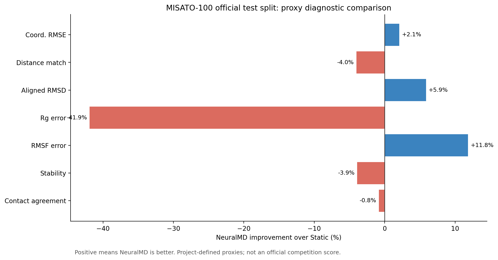
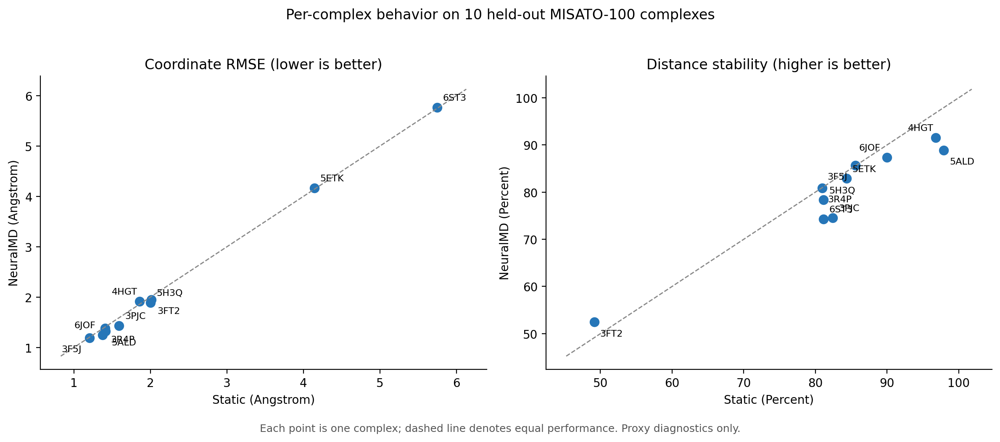
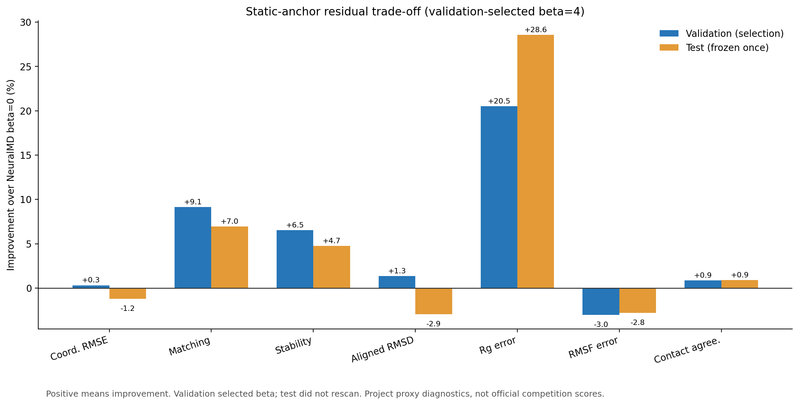
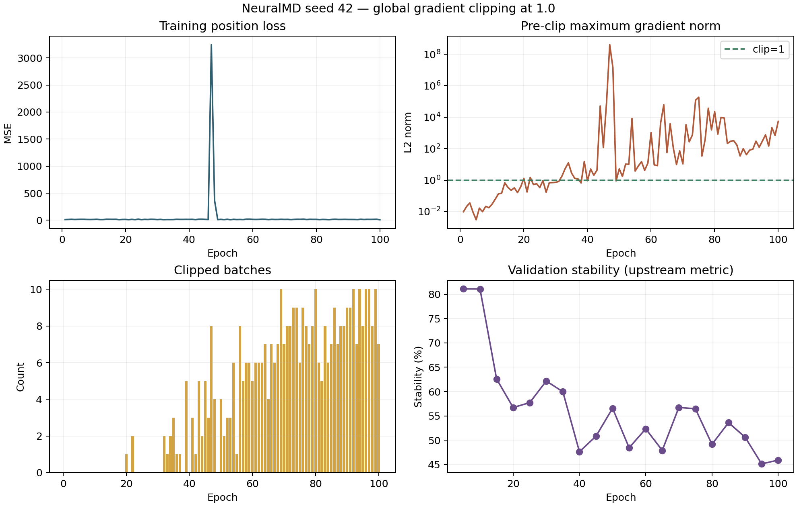
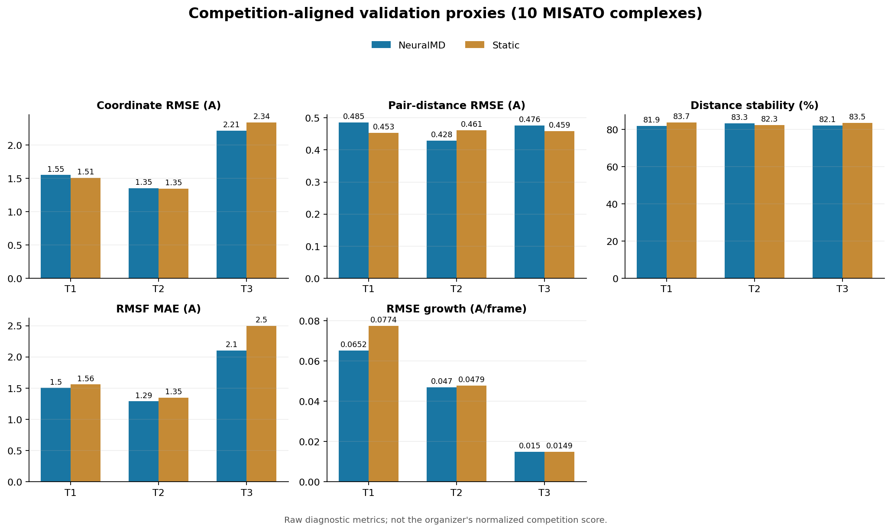
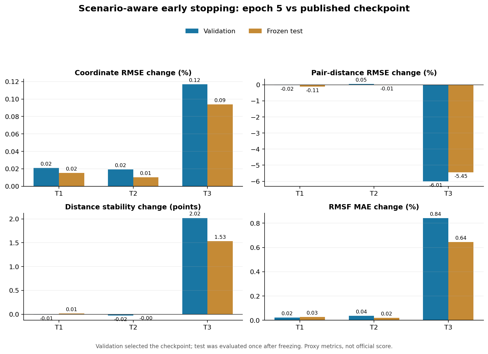
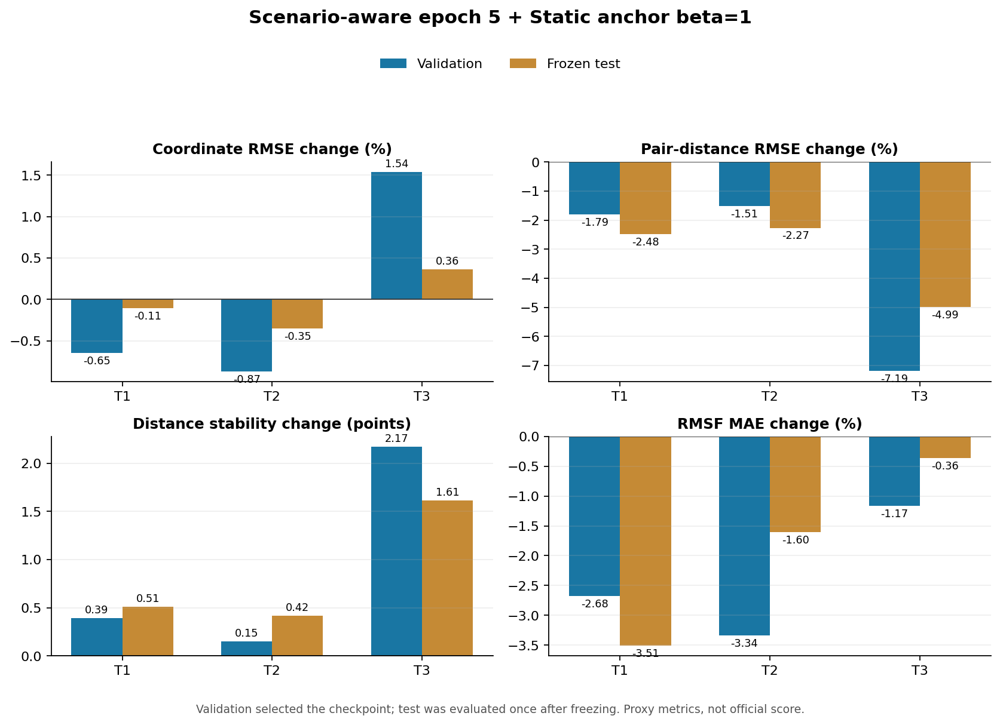

# Protein-Quanta 实验进展报告

> 这是持续更新的实验总账。详细 JSON、单次复现说明和图片保留在 `reports/reproduction/` 与 `reports/figures/`。

## 项目状态

| 项目 | 当前状态 |
|---|---|
| 数据 | MISATO-100 已下载并校验；100/100 复合物审计通过 |
| 统一评估器 | Static、Linear、NeuralMD checkpoint 及 T1/T2/T3 场景评估已接入 |
| 官方 checkpoint | 测试集 10 个复合物、100 帧完成 |
| 从头训练 | 官方配置已纠正；seed 42 best 几乎逐位复现发布 checkpoint |
| 创新实验 | epoch-5 场景早停 + Static anchor `β=1` 通过；E6/E6b Pair no-go |
| 测试 | 本地与服务器均为 77 项通过；服务器另有 4 项按环境预期跳过 |

## 2026-08-10 至 2026-08-11：复现基础设施

### 关键决策

1. 比赛指导手册公开了单场景 `Geo/Phys/Dyn/Stab = 40%/25%/25%/10%`，以及总分 `T1/T2/T3 = 50%/30%/20%`；但没有提供可执行的归一化与官方评分代码，因此本地新增指标仍只标为项目代理诊断，不拼接伪“总分”。
2. 数据和模型权重不进入 Git；所有 checkpoint 记录 SHA256。
3. 使用 NeuralMD 作者维护的 condition-aware `torchdiffeq` fork，固定 commit `3d7c7ec8c534a9b18b8b7c7d1fea0c235e6468d0`。
4. 发布权重结构与上游 parser 默认值不同；从 state dict 识别 100 个 radial bases 和关闭 velocity refinement，并执行严格加载。

### 已完成成果

- Static/Linear 基线、MISATO 审计器、统一代理指标、NeuralMD 单样本与分割批量评估器。
- 发布 checkpoint SHA256：`364404a7ce61ec1180fa3800c0dcbddf377b672d22f915fc6b19d202710a4a5a`；missing/unexpected keys 均为 0。
- 10 个测试复合物的官方预处理与项目预处理最大绝对差均小于 `1e-6 Å`。

## 2026-08-11：发布 checkpoint 基线

### 测试集 100 帧

| 模型 | 坐标 RMSE（Å，↓） | Matching（Å，↓） | Stability（%，↑） | 对齐 RMSD（Å，↓） | Rg MAE（Å，↓） | RMSF MAE（Å，↓） | 接触一致率（↑） |
|---|---:|---:|---:|---:|---:|---:|---:|
| NeuralMD | 2.2286 | 0.4503 | 79.69 | 0.7465 | 0.1277 | 2.3419 | 0.9615 |
| Static | 2.2761 | 0.4329 | 82.94 | 0.7932 | 0.0900 | 2.6565 | 0.9696 |
| Linear | 37.3079 | 50.2041 | 6.83 | 36.9511 | 34.7432 | 26.6246 | 0.6593 |

结论：NeuralMD 捕获了非平凡动态并改善坐标/RMSF，但 Static 在 Matching、Stability、Rg 和接触图上仍更强。Linear 长程发散，不再作为可竞争方案。

### 数值积分消融

验证集 100 帧下，Euler 步长 5/2.5/1 的坐标 RMSE 分别为 2.4804/2.4802/2.4801 Å，Stability 分别为 76.38/76.14/76.00%。减小步长没有解决几何漂移，保留官方步长 5。

## 2026-08-11：从首帧开始的长跨度压力训练（后验更正）

### 配置

- seed 42，100 epochs，batch size 8，Adam，学习率 `1e-4`；
- 从第 0 帧开始、随机终点 1–99 的可变长训练片段；Euler step 5，scaling 100；
- 原始位置 MSE，无梯度裁剪，无几何正则。

### 关键观察

- 最优验证 checkpoint 约在 epoch 40。
- epoch 48 的平均位置损失出现约 `4531` 的尖峰。
- 尖峰后 Stability 长期停在约 52.6%，说明训练未自行恢复。

| 权重 | 测试坐标 RMSE（Å，↓） | Matching（Å，↓） | Stability（%，↑） | Rg MAE（Å，↓） |
|---|---:|---:|---:|---:|
| 发布 checkpoint | 2.2286 | 0.4503 | 79.69 | 0.1277 |
| 从头训练 best | 2.2566 | 0.5668 | 69.05 | 0.1980 |
| 从头训练 final | 2.5403 | 1.2492 | 52.21 | 0.2731 |

### 权重

- best SHA256：`ef33b335ae1ef8488015f11ceed4af4dca24eb46446a7b5f88f05190d636aa72`
- final SHA256：`9222dcd8ca33a6a7b6b5985234830324e67ca5c53fef0cc30ea8fc7a9fef08aa`

### 阶段结论与配置更正

原始坐标 MSE 能得到接近发布权重的坐标 RMSE，但不能稳定保持内部几何；单次异常梯度可破坏后续全部训练。2026-08-12 复核官方 `hyperparameter.txt` 后确认，本次命令遗漏了 `--no_NeuralMD_Binding_start_with_first_frame`，导致 `frame_num=20` 未生效。因此本节结果重新定义为**最长 99 帧的压力实验**，不再声称是官方训练配置复现。

## 创新突破路线与当前假设

详见 `docs/experiment-design-and-research-roadmap.md`。当前按以下顺序推进：

1. C1：Static 锚点残差的验证/测试可行性实验（已通过）；
2. R2：纠正官方窗口采样并建立 T1/T2/T3 对齐评估（训练已完成）；
3. E3-L：长跨度压力训练下的梯度裁剪 1.0（已完成，no-go）；
4. E6：成对距离 Smooth-L1 与长跨度泛化的受控实验；
5. E7：速度/Rg 辅助监督；
6. E8：可学习锚点门控。

每个阶段完成后，本报告追加实验编号、Git commit、配置、数字、图表和 go/no-go 决策。

## 2026-08-12：C1 Static 锚点残差可行性

### 假设与预注册

把 NeuralMD 预测写成相对最后观测构象的动态残差，并按

\[
\hat{x}_t=x_{static}+\exp(-\beta t/98)(x_t^{NMD}-x_{static})
\]

随时间抑制漂移。验证集只扫描 `β ∈ {0, 0.25, 0.5, 1, 2, 4, 8}`。候选必须满足：RMSF MAE 不超过 `β=0` 的 105%，坐标 RMSE 不超过 102%；在合格候选中最大化 Stability，再以 Matching 和较小 β 打破并列。测试集不重新扫描。

### 验证集决策

预注册规则选择 `β=4.0`。

| 指标 | NeuralMD `β=0` | Anchor `β=4` | 变化 |
|---|---:|---:|---:|
| 坐标 RMSE（Å，↓） | 2.4804 | 2.4726 | 改善 0.3% |
| Matching（Å，↓） | 0.5742 | 0.5218 | 改善 9.1% |
| Stability（%，↑） | 76.38 | 81.36 | +4.99 个百分点 |
| 对齐 RMSD（Å，↓） | 0.8959 | 0.8839 | 改善 1.3% |
| Rg MAE（Å，↓） | 0.1578 | 0.1254 | 改善 20.5% |
| RMSF MAE（Å，↓） | 2.3249 | 2.3953 | 恶化 3.0% |
| 接触一致率（↑） | 0.9614 | 0.9696 | 改善 0.9% |

达到 go 条件：Stability 提升超过 2 个百分点、Matching 改善超过 5%，且两个防塌缩约束均满足。

### 冻结测试集结果

`β=4.0` 由验证集冻结；测试集只比较 `β=0` 与 `β=4` 一次。

| 指标 | NeuralMD `β=0` | Anchor `β=4` | Static | 结论 |
|---|---:|---:|---:|---|
| 坐标 RMSE（Å，↓） | 2.2286 | 2.2556 | 2.2761 | 较 NeuralMD 恶化 1.2%，仍优于 Static |
| Matching（Å，↓） | 0.4503 | 0.4189 | 0.4329 | 较 NeuralMD 改善 7.0%，也优于 Static |
| Stability（%，↑） | 79.69 | 83.47 | 82.94 | +3.78 个百分点，也优于 Static |
| 对齐 RMSD（Å，↓） | 0.7465 | 0.7685 | 0.7932 | 较 NeuralMD 恶化 2.9%，仍优于 Static |
| Rg MAE（Å，↓） | 0.1277 | 0.0912 | 0.0900 | 改善 28.6%，略差于 Static |
| RMSF MAE（Å，↓） | 2.3419 | 2.4075 | 2.6565 | 恶化 2.8%，仍优于 Static |
| 接触一致率（↑） | 0.9615 | 0.9700 | 0.9696 | 改善 0.9%，略优于 Static |

### 科研结论

固定时间衰减已经在未参与选择的测试集复现了验证集方向：它显著修复 Matching、Stability、Rg 和接触图，同时保留大部分坐标与 RMSF 动态信息。Anchor `β=4` 在七项指标中六项优于 Static，仅 Rg MAE 略差。这支持以下更强假设：不同复合物、不同时间点需要不同的动态残差置信度；固定 β 应升级为保持 SE(3) 性质的可学习门控，而不是继续手调全局 β。

### 产物

- `reports/reproduction/anchor_residual_val_scan.json`
- `reports/reproduction/anchor_residual_test_frozen.json`
- `reports/figures/anchor_residual_tradeoff.png`
- `protein_quanta/anchoring.py`
- `scripts/evaluate_anchor_residual.py`

## 2026-08-12：E3-L 长跨度压力训练（梯度裁剪 1.0）

### 受控设计

只增加全局 L2 梯度范数裁剪 `1.0`、裁剪前范数日志和非有限更新保护。数据划分、seed 42、网络、位置 MSE、从第 0 帧开始的随机长跨度、Euler 配置、Adam 与学习率均保持不变。有限但很大的损失仍参与反向传播；只有非有限 loss/gradient 才跳过。该实验与上一节压力配置严格对照，但不是官方 20 帧窗口配置。

1 epoch 预检成功保存 best/final checkpoint，且日志字段完整。随后在 A6000 GPU 0 完成 100 epoch。权重与原始日志保存在服务器 Git 仓库外。

### 训练现象

- 100 epoch 中有 68 个 epoch 至少发生一次裁剪，共裁剪 408 个 batch；非有限跳过数为 0。
- 最大单 epoch 平均位置损失为 `3244.37839`（epoch 47）。
- 最大单 batch 裁剪前梯度范数为 `403,650,528`（epoch 47）；epoch 48 仍达到 `13,917,789`。
- 梯度裁剪阻止了非有限更新，却没有阻止验证几何质量持续退化。
- 上游按验证坐标 MAE 保存的 best 位于 epoch 35，而最高验证 Stability 出现在 epoch 5；这进一步证明单一坐标误差不是可靠的模型选择准则。

### 统一 100 帧验证集结果

以下均为同一统一评估器的 10 个验证复合物无权平均；未运行新的统一测试集评估。

| 权重 | 坐标 RMSE（Å，↓） | Matching（Å，↓） | Stability（%，↑） | 对齐 RMSD（Å，↓） | Rg MAE（Å，↓） | RMSF MAE（Å，↓） | 接触一致率（↑） |
|---|---:|---:|---:|---:|---:|---:|---:|
| 未裁剪 best | 2.4683 | 0.6743 | 66.64 | 0.9669 | 0.2317 | 2.2242 | 0.9407 |
| 裁剪 best | 2.4714 | 0.7638 | 59.69 | 1.0036 | 0.3079 | 2.1766 | 0.9286 |
| 未裁剪 final | 2.6924 | 1.2298 | 52.27 | 1.6365 | 0.3254 | 2.0266 | 0.8794 |
| 裁剪 final | 2.9152 | 1.4080 | 45.52 | 1.7112 | 0.4141 | 1.5954 | 0.8688 |

相对未裁剪 final，裁剪 final 的 Stability 下降 6.75 个百分点，坐标 RMSE 恶化约 8.3%；相对未裁剪 best，裁剪 best 的 Stability 下降 6.95 个百分点。预注册 go 条件失败，因此在该长跨度压力设定下明确 **no-go**，不继续扫描裁剪阈值，也不做三 seed 扩展。此结论不得外推为“官方 20 帧配置下裁剪必然无效”。

### 决策与下一假设

该负结果否定的是“单独梯度裁剪足以恢复长程质量”，不是梯度监控本身。数据表明异常批次会产生极大的梯度，但固定裁剪仍允许模型在高方差随机跨度目标下逐步偏离几何有效区域。下一阶段优先处理目标错配：以成对距离损失直接对准 Matching/Stability，并比较更受控的跨度采样；C1 固定锚点继续作为当前最稳健的初赛候选，不因 E3 失败而撤回。

### 产物与权重溯源

- best SHA256：`2f33bb71231b935a427fdd8861ac3baf3d181ff57b0c624f1c25572ed3da83e6`
- final SHA256：`98b5ea5d004b814543916dc435e53843bcd0206b92f61d932a2263875a43bd28`
- `reports/reproduction/neuralmd_misato100_clip1_best_val.json`
- `reports/reproduction/neuralmd_misato100_clip1_final_val.json`
- `reports/reproduction/neuralmd_misato100_retrained_final_val.json`
- `reports/reproduction/2026-08-12-neuralmd-stable-training.md`

## 2026-08-12：R2 官方 20 帧窗口训练纠正与精确复现

### 根因与修正

官方 Hugging Face `hyperparameter.txt` 明确包含 `--no_NeuralMD_Binding_start_with_first_frame --NeuralMD_Binding_frame_num=20`。上游代码在该开关为 false 时，才会令 `start=max(0,end-20)`；此前遗漏开关导致窗口长度参数被旁路。现在由 `protein_quanta.neuralmd_training.build_training_command` 显式生成所有布尔参数，并有回归测试防止再次遗漏。

1 epoch 预检触发上游边界缺陷：`print_every_epoch=5` 时没有任何验证记录，却在结束处读取 best 数组而报 `IndexError`。最小有效预检改为 5 epoch 后完成，未修改模型逻辑。

### 复现结果

纠正配置完成 seed 42、100 epoch。上游按验证 coordinate MAE 选择 epoch 15 为 best。统一验证集 100 帧结果如下：

| 权重 | 坐标 RMSE（Å，↓） | Matching（Å，↓） | Stability（%，↑） | 对齐 RMSD（Å，↓） | Rg MAE（Å，↓） | RMSF MAE（Å，↓） | 接触一致率（↑） |
|---|---:|---:|---:|---:|---:|---:|---:|
| 发布 checkpoint | 2.4804332 | 0.5741583 | 76.3756 | 0.8958692 | 0.1577934 | 2.3248793 | 0.9614264 |
| 纠正训练 best | 2.4804328 | 0.5741685 | 76.3746 | 0.8958735 | 0.1577995 | 2.3248730 | 0.9614258 |
| 纠正训练 final | 95106.2867 | 146546.2032 | 25.8781 | 103624.8019 | 103622.7072 | 54972.4733 | 0.7321 |

best 与发布 checkpoint 的坐标 RMSE 差约 `4.2×10^-7 Å`，Stability 只差 `0.00095` 个百分点，可视为精确复现。训练期位置损失始终有限（最大 epoch 均值 20.7566），最大批梯度范数仅 27.01；然而 final 的 100 帧 rollout 灾难性发散。这把根因从“单纯梯度爆炸”推进为更具体的证据：**20 帧局部训练目标不能约束 100 帧闭环外推，模型选择必须显式观察 T1/T2/T3 的不同时间窗。**

### 产物

- best SHA256：`fc9092027d05af9a9a40159177d091a94ebef847f5a4dedd9ed0ef1a80bf92ec`
- final SHA256：`d7a2ee0bfa12a63b4fca0d462a39ca37f45d4bbc67bc53cfac34235af75c4362`
- `reports/reproduction/neuralmd_misato100_official_corrected_best_val.json`
- `reports/reproduction/neuralmd_misato100_official_corrected_final_val.json`
- `reports/reproduction/2026-08-12-neuralmd-official-corrected.md`

## 2026-08-12：T1/T2/T3 竞赛场景验证基准

### 协议冻结

- T1：观测帧 0–1，预测帧 2–19（18 帧）；
- T2：观测帧 0–79，以帧 78–79 初始化，预测帧 80–99（20 帧）；
- T3：观测帧 0–19，以帧 18–19 初始化，预测帧 20–99（80 帧）。

每个场景都把最后两个观测帧转换为位置/速度初值，随后使用与论文一致的 Euler 配置独立滚动。表中为 10 个验证复合物的无权平均原始代理指标，不是官方归一化分数。

| 场景 | 方法 | 坐标 RMSE（Å，↓） | Matching（Å，↓） | Stability（%，↑） | RMSF MAE（Å，↓） | RMSE 增长率（Å/帧，↓） |
|---|---|---:|---:|---:|---:|---:|
| T1 | NeuralMD | 1.5506 | 0.4855 | 81.90 | 1.5034 | 0.0652 |
| T1 | Static | **1.5095** | **0.4535** | **83.73** | 1.5585 | 0.0774 |
| T2 | NeuralMD | 1.3510 | **0.4284** | **83.31** | **1.2887** | **0.0470** |
| T2 | Static | **1.3455** | 0.4607 | 82.27 | 1.3500 | 0.0479 |
| T3 | NeuralMD | **2.2139** | 0.4763 | 82.08 | **2.1020** | 0.0150 |
| T3 | Static | 2.3390 | **0.4590** | **83.54** | 2.4968 | **0.0149** |

发布 checkpoint 与纠正训练的 best checkpoint 在全部场景、全部标量指标上的绝对差均小于 `1e-3`，因此场景评估也复现一致。两份报告 SHA256 分别为 `5fe9ad31d4dc3f25e69647babf90329c31afeed0137978807d06af9637dd71d2` 与 `f5fa89cfff98d972e22a57b9ce2067e8e0334dfd41fa4fa392362534e401ce48`。

### 对创新方向的约束

结果否定了“NeuralMD 在所有时间尺度都自然优于静态基线”的假设。T1 中 Static 同时赢得坐标、Matching 与 Stability；T2 是 NeuralMD 最均衡的窗口；T3 中 NeuralMD 保留更真实的坐标变化和 RMSF，但牺牲了 Matching/Stability。由此冻结 E6 的目标：首先用 `L_pair` 修复 T1/T3 的内部几何，同时用坐标、RMSF 和误差增长率防止模型退化成 Static。若只改善 Stability 而损害 T3 动态性，则判为失败。

### 产物

- `reports/reproduction/neuralmd_scenarios_published_val.json`
- `reports/reproduction/neuralmd_scenarios_corrected_best_val.json`
- `reports/figures/neuralmd_scenario_baselines.png`

## 2026-08-12：E6 Pair loss 的 no-go 与场景感知早停突破

### E6/E6b

按 10 个训练批次的梯度尺度把 `L_pair` 初始贡献校准到 10%，冻结 `λ_pair=0.67725090936284`。零权重 5-epoch preflight 与旧官方 preflight 的最大参数差仅 `1.19×10^-7`。完成 seed 42 / 100 epoch 及 seeds 0/123 / 20 epoch，并逐个评估周期 checkpoint。

虽然 Pair 运行的 epoch 5/10 相对发布权重满足 T3 门槛，但同 epoch 的 `λ=0` 因果对照显示差异只有 `10^-6` 量级；早期收益并非 Pair 造成。Pair 到 epoch 20 才相对纯位置训练显著改善 T3 Matching/Stability，但两者都已经差于发布基线。把梯度目标提高到 50% 也只延迟崩坏并导致碰撞率上升。故 E6/E6b 不作为已验证创新，不继续扫参。

### 场景感知早停

真正稳定复现的结果是纯位置训练 epoch 5。验证集 seeds 0/42/123 的变化几乎一致；冻结 seed 42 / epoch 5 后，测试集只评估一次：

| 数据 | T1 坐标/Matching | T2 坐标/Matching | T3 坐标 | T3 Matching | T3 Stability | T3 RMSF |
|---|---:|---:|---:|---:|---:|---:|
| Validation | +0.02% / -0.02% | +0.02% / +0.05% | +0.12% | **-6.01%** | **+2.02 点** | +0.84% |
| Frozen test | +0.02% / -0.11% | +0.01% / -0.01% | +0.09% | **-5.45%** | **+1.53 点** | +0.64% |

这里百分比均相对发布 checkpoint，误差类负值为改善。结果说明官方 coordinate-MAE checkpoint selection 与比赛多场景目标不一致。当前初赛候选升级为“场景感知 epoch-5 checkpoint”，selected checkpoint SHA256：`0e7d5150aa5f305499f17663d3a74b1063b0591733f534e676303ce11de50b8c`。

完整因果消融、E6/E6b 失败数据与限制见 `reports/reproduction/2026-08-12-neuralmd-pair-loss-and-earlystop.md`。

### 初赛首选组合更新

固定 epoch-5 后，在验证集检查 C1 锚点：`β=4/2` 分别因 T3 坐标代价 3.72%/2.54% 失败；`β=1` 把代价控制为 1.54%，同时改善 T1/T2 全部四项指标。冻结组合测试后，相对发布 checkpoint：

- T1：坐标 -0.11%、Matching -2.48%、Stability +0.51 点、RMSF -3.51%；
- T2：坐标 -0.35%、Matching -2.27%、Stability +0.42 点、RMSF -1.60%；
- T3：坐标 +0.36%、Matching -4.99%、Stability +1.61 点、RMSF -0.36%。

因此当前首选为 `seed 42 / epoch 5 / anchor β=1`。除 T3 坐标轻微代价外，冻结测试其余 11 项比较全部改善。

## 2026-08-12：Phys 碰撞代理审计

指导手册把 Phys 设为每个场景的 25%，因此对冻结组合补做了原子重叠初筛。规则为“原子间距离小于两者共价半径之和”；配体内部只统计非对角、无重复原子对，配体—蛋白统计所有跨分子原子对。验证集用于审计，冻结内部测试不回调参数。

| 数据 | 场景 | 配体内部：Anchor−NeuralMD（百分点） | 配体—蛋白：Anchor−NeuralMD（百分点） |
|---|---|---:|---:|
| Validation | T1 | +0.187458 | +0.000000 |
| Validation | T2 | +0.229778 | -0.000354 |
| Validation | T3 | +0.060177 | +0.001135 |
| Frozen test | T1 | +0.170025 | +0.000000 |
| Frozen test | T2 | +0.090809 | -0.000120 |
| Frozen test | T3 | -0.044150 | -0.000027 |

配体—蛋白重叠比例极低，且没有一致升高；配体内部代理则在 6 个比较中有 5 个小幅升高。关键限制是当前 NeuralMD/MISATO 预处理没有共价键表，正常成键近邻也被统计，因此绝对比例不是化学有效的 clash rate。决策是：保留 `epoch 5 + β=1` 为当前多指标候选，但不宣称 Phys 得到改善，也不构造本地总分；将 bond-aware 键长、键角、立体化学及能量/有效性检查列为后续硬门槛。

完整协议和原始数据见 `reports/reproduction/2026-08-12-collision-proxy-audit.md`。

## 2026-08-12：初赛材料合规复核

重新逐页核验指导手册与算法赛初赛模板，确认初赛截止日期为 8 月 16 日、Top 40 进入复赛、算法赛跨方向权重为 45%/30%/20%/5%，方向二内部权重为 `Geo/Phys/Dyn/Stab=40/25/25/10` 与 `T1/T2/T3=50/30/20`。手册为规划版本且没有写具体截止时刻，因此官网/群公告仍需人工最终复核。

模板明确禁止使用 AI 作答。项目据此只输出可检查的实验事实、原始数据、图表、复现入口和缺口清单，不生成可直接提交的答卷文字。逐模板字段的证据映射、P0/P1 风险和 8 月 12-16 日三人分工见 `docs/preliminary-submission-compliance-checklist.md`。当前 P0 包括：具体提交时刻/入口待人工核实、项目级 LICENSE 尚未选择、NeuralMD 上游许可状态待澄清、Phys 只有无键表碰撞初筛。

## 2026-08-12：服务器环境证据归档

新增白名单式环境采集器，只记录 Python、操作系统内核/架构、关键 Python 包、PyTorch/CUDA 与 GPU 型号/显存；明确不采集用户名、主机名、路径或环境变量。服务器实测为 Python 3.10.20、PyTorch 2.6.0+cu124、CUDA 12.4、4 张 NVIDIA RTX A6000（每张可见显存 47.402 GiB）。完整包版本见 `reports/reproduction/server-environment.json`。新增 3 项回归测试后，本地和服务器均为 77 项通过，服务器 4 项可选绘图测试跳过。

## 2026-08-12：官网公开信息复核

GOAI 官网 AI for Research 页面公开内容与本地手册一致：8 月 16 日初赛截止；Top 40 由算法赛与开放探索赛各 20 队组成；复赛后 Top 20 由两类各 10 队组成。公开页面仍未给具体截止时刻或算法赛文件格式/大小。官网链接的 Datawhale 方向二 baseline 教程页摘要另确认：每队只能选择一个算法方向；官网作品最多提交 3 次，以最后一次为准。上述公开入口与未确认项已写入 `docs/preliminary-submission-compliance-checklist.md`。

继续读取方向二教程正文及其赛题解读 PDF 后，确认上传流程为“人工完成 Word（手动补第六部分团队介绍）→ 压缩为 ZIP → 官网填写并上传”。Datawhale 截图打卡属于 Token Plan 激励，不等同于赛事提交。发现 7 月解读 PDF 的 Top 50/Top 15 已与当前官网 Top 40/Top 20 冲突；按来源优先级采用当前官网，并在 `reports/reproduction/2026-08-12-official-materials-audit.md` 留存冲突与未决项。
