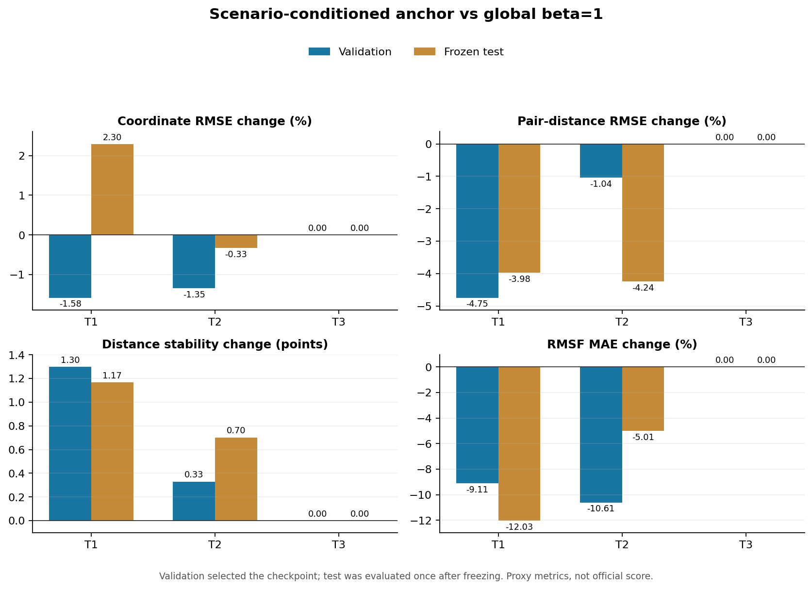

# 场景条件锚定实验：验证改善但冻结测试 no-go

## 研究问题

当前初赛冻结候选使用 `seed 42 / epoch 5 / global beta=1`。验证集显示 T1/T2 能承受更强 Static residual anchor，而 T3 在 `beta>1` 后坐标误差明显增加。本实验检验仅使用已知竞赛场景进行条件门控是否足以改进固定全局锚点。

设计与晋升门槛在查看本实验 frozen-test 前已提交至 `docs/superpowers/specs/2026-08-12-scenario-conditioned-anchor-design.md`（commit `e5dba58`）。冻结策略为 `T1=8, T2=8, T3=1`，decay scale 为 98。测试集结果不得用于改变映射。

## 数据、环境与执行

- 数据：MISATO-100 validation/test，各 10 个复合物；每个复合物独立评估 T1/T2/T3。
- 输入：已归档的 seed-42 epoch-5 场景轨迹；未重新训练网络。
- 环境：服务器 Python 3.10.20、PyTorch 2.6.0+cu124、CUDA 12.4、NVIDIA RTX A6000。
- 代码：commit `9a9d5ba`；服务器干净克隆标准库回归为 90 tests OK、4 optional plotting tests skipped。
- 指标：coordinate RMSE、Matching、Stability、RMSF MAE；全部是内部复现代理，不是官方总分。

复现命令中的服务器根目录用占位符表示：

```bash
PYTHONPATH=. PYTHON scripts/evaluate_anchor_scenarios.py \
  --trajectory-dir SERVER_RUN_ROOT/early-stop/epoch005-val-trajectories \
  --reference-report SERVER_RUN_ROOT/early-stop/epoch005_val_with_trajectories.json \
  --output SERVER_RUN_ROOT/scenario-anchor881/validation.json \
  --scenario-betas T1=8 T2=8 T3=1 \
  --decay-scale-frames 98 --split-label validation --selection-allowed \
  --policy-source docs/superpowers/specs/2026-08-12-scenario-conditioned-anchor-design.md
```

冻结测试使用相同命令和映射，仅把输入/输出切换为 test，并设置 `--split-label frozen-internal-test`、移除 `--selection-allowed`。输出文件在运行前不存在，随后只执行一次。

## 相对当前 global beta=1 的结果

误差类负值表示改善；Stability 使用百分点差。

| 数据 | 场景 | 坐标 RMSE | Matching | Stability | RMSF MAE |
|---|---|---:|---:|---:|---:|
| Validation | T1 | -1.58% | -4.75% | +1.30 点 | -9.11% |
| Validation | T2 | -1.35% | -1.04% | +0.33 点 | -10.61% |
| Validation | T3 | 0.00% | 0.00% | 0.00 点 | 0.00% |
| Frozen internal test | T1 | **+2.30%** | -3.98% | +1.17 点 | -12.03% |
| Frozen internal test | T2 | -0.33% | -4.24% | +0.70 点 | -5.01% |
| Frozen internal test | T3 | 0.00% | 0.00% | 0.00 点 | 0.00% |



validation 上 10 个复合物×3 个场景齐全，指标均为有限值；T3 相对未锚定 epoch-5 checkpoint 的坐标比值为 `1.014188`，通过预注册的 `<=1.02` 防线。因此才执行 frozen-test。

## 预注册门槛判定

| 晋升门槛 | 结果 |
|---|---|
| Frozen T1 Matching 降低且 Stability 上升 | 通过（-3.98%，+1.17 点） |
| Frozen T2 Matching 降低且 Stability 上升 | 通过（-4.24%，+0.70 点） |
| 所有场景坐标 RMSE 相对 global beta=1 不恶化超过 2% | **失败：T1 +2.295335%** |
| 所有场景 RMSF MAE 不恶化超过 5% | 通过 |

最终决策：**no-go，不晋升。** `configs/frozen_candidate.json` 保持 `global beta=1`，不因测试结果把 T1 调回 4、2 或其他值。

## 科研结论与下一步

场景条件并非无效：T1/T2 的 Matching、Stability 和 RMSF 在 validation 与 frozen-test 上方向一致，说明更强锚定确实能抑制部分几何漂移。但 T1 冻结测试坐标代价从 validation 的改善翻转为 `+2.30%`，表明“场景 ID → 固定强度”仍把复合物间异质性压成单一决策。

因此 C2 可学习门控的必要条件被收紧：下一版必须使用推理时可观测、SE(3) 不变的样本/状态不确定性特征，并把坐标风险作为显式 guard；不能仅把 T1/T2 设为更大的常数 beta。由于每个 split 只有 10 个复合物，下一轮应采用严格的 leave-one-complex-out 验证并限制模型容量，未通过交叉验证前不再触碰 frozen-test。

## 证据与限制

- validation JSON SHA256：`7b0e01e20bb612880354c12ea258d242a26abd7f999a68b60af6839e8c30dc67`
- frozen-test JSON SHA256：`32bdea911b4d4e5bf24969f1b6affde70f6a9d99cd4ddea67b5c5d9c401da3d5`
- 机器可读判定：`reports/reproduction/scenario_anchor881_decision.json`
- 样本量小，结果只能支持内部方向判断，不能外推至全部蛋白–配体体系。
- 本实验没有补齐 bond-aware Phys 指标，也没有官方归一化评分器，因此不报告 Phys 改善或本地复合总分。

