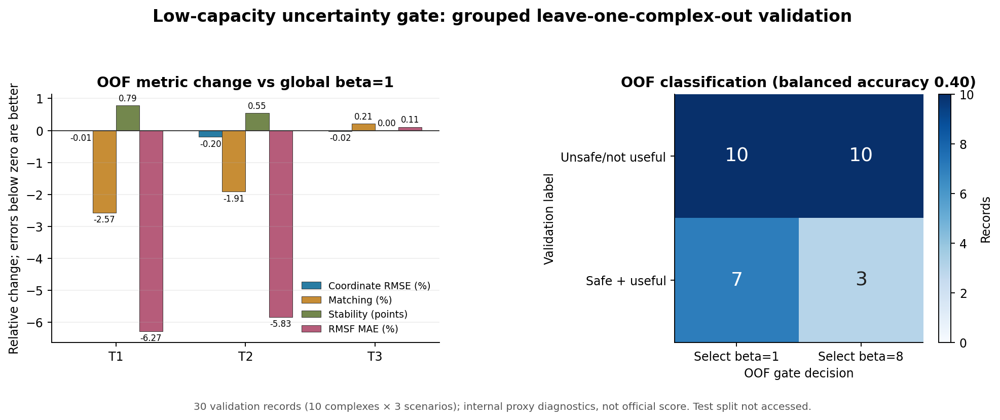

# 低容量不确定性门控：聚合改善但 OOF 判别失败

## 技术摘要

本实验检验一个低容量、SE(3) 不变的逻辑门控能否在 `beta=1` 与 `beta=8` 之间识别“强锚定安全且有益”的轨迹。30 条 validation 场景记录采用按复合物分组的 leave-one-complex-out（LOOCV），每折完整留出一个复合物的 T1/T2/T3；内部 test 未被读取。

OOF 聚合轨迹相对 global `beta=1` 改善了 T1/T2 的 Matching、Stability 和 RMSF，坐标防线也通过。但门控对预注册安全/收益标签的 balanced accuracy 只有 `0.40`，低于 `0.60` 门槛：20 个负类中误选强锚定 10 个，10 个正类仅识别 3 个。因此本实验判定 **no-go**，不冻结模型、不访问 test，也不修改当前初赛候选。

## 聚合收益不能替代跨复合物判别能力

相对 global `beta=1`，误差类负值为改善，Stability 使用百分点差。

| 场景 | 坐标 RMSE | Matching | Stability | RMSF MAE |
|---|---:|---:|---:|---:|
| T1 | -0.01% | -2.57% | +0.79 点 | -6.27% |
| T2 | -0.20% | -1.91% | +0.55 点 | -5.83% |
| T3 | -0.02% | +0.21% | 0.00 点 | +0.11% |

T1/T2 的几何与动力学代理方向一致，且所有场景 coordinate RMSE 与 RMSF guard 通过。然而这些均值由门控对不同记录的选择共同形成，不能证明它确实学会了哪些复合物适合强锚定。

右图给出更关键的泛化证据：负类召回率 `0.50`、正类召回率 `0.30`，balanced accuracy 为 `0.40`。门控在 30 条记录中选择 `beta=8` 13 次，比例 `43.3%` 虽处于预注册的 20%–80% 范围，但 13 次中只有 3 次是真正的正类选择。

## 范围、数据和标签定义

- 数据：MISATO-100 validation，10 个复合物，每个包含 T1/T2/T3，共 30 条记录。
- 分组：复合物 ID；每折训练 9 个复合物的 27 条记录，预测剩余复合物的 3 条记录。
- 基线动作：`beta=1`；强动作：`beta=8`；decay scale 固定为 98。
- 正类标签：`beta=8` 相对 `beta=1` 同时满足坐标 RMSE `<=+2%`、RMSF `<=+5%`、Matching 严格降低、Stability 严格升高。
- 标签分布：T1 `5/10`、T2 `3/10`、T3 `2/10`，总计 `10/30`。
- 所有指标为内部复现代理，不是官方归一化分数。

## 模型与泄漏控制

模型为固定 L2=`10.0` 的 balanced logistic regression，使用确定性 Newton/IRLS 求解和固定 `0.5` 阈值。没有根据 OOF 结果调整正则、阈值、特征或候选 beta。

输入只包含推理时可获得且对整体旋转/平移不变的量：

1. 配体重原子数；
2. 最后两帧观测的 RMS 位移；
3. 未锚定预测轨迹的内部成对距离漂移；
4. 未锚定预测末帧相对最后观测帧的回转半径变化；
5. T2/T3 场景指示变量。

未来真值只用于 validation 标签和 OOF 评价，不进入特征。每折标准化统计与模型系数仅由该折 9 个训练复合物计算。机器可读报告保存全部 10 折的训练样本 ID、标签数、标准化统计、系数及逐记录 OOF 概率；复核确认每个复合物恰好被完整留出一次。

## 预注册门槛

| 条件 | 结果 |
|---|---|
| T1 Matching 降低且 Stability 上升 | 通过 |
| T2 Matching 降低且 Stability 上升 | 通过 |
| 所有场景 coordinate RMSE 不恶化超过 2% | 通过 |
| 所有场景 RMSF MAE 不恶化超过 5% | 通过 |
| 强锚定 OOF 选择率在 20%–80% | 通过（43.3%） |
| OOF balanced accuracy `>=0.60` | **失败（0.40）** |

最终判定：**validation no-go**。由于实验在 validation 阶段已经失败，严格不访问内部 test，`configs/frozen_candidate.json` 保持 global `beta=1`。

## 限制、鲁棒性和失败解释

- 样本量只有 10 个独立复合物；30 条场景记录不是 30 个独立分子，因此必须按复合物分组，不能做普通随机交叉验证。
- 六个输入维度相对 27 条折内记录仍不算极低；强 L2 限制了系数，但无法创造稳定的跨分子信号。
- OOF 概率集中在阈值附近：T1 均值约 0.544、T2 约 0.513、T3 约 0.435，说明模型置信度弱，固定阈值容易翻转。
- 聚合 T1/T2 改善并非伪造，但它与低分类精度并存；在安全门控任务中，无法识别个体风险比有利均值更关键。
- 本实验不评估 bond-aware Phys、能量或立体化学，不能声称物理合理性改善。

## 下一步决策

初赛主线不再继续门控调参。截止日前保留已有 `epoch 5 + global beta=1`，把本实验作为诚实的创新边界与复赛假设证据。复赛若继续 C2，应优先获取更多独立复合物或使用训练 split 构建门控训练集，再锁定 validation；方法上应从二分类升级为直接预测“坐标风险与几何收益”的双输出模型，并使用保守拒绝机制，只有在预测风险上界低于阈值时才采用强锚定。

进一步问题包括：哪些未使用的无真值量（模型集成方差、时间局部 Jacobian、能量代理、蛋白口袋接触变化）能提供跨复合物的不确定性信号；以及增加独立复合物后，OOF 概率是否仍集中在 0.5 附近。

## 可复核产物

- 预注册：`docs/superpowers/specs/2026-08-12-uncertainty-gate-loocv-design.md`（commit `a45a7ab`）
- 实现：`protein_quanta/uncertainty_gate.py`、`scripts/evaluate_uncertainty_gate.py`（commit `f6ae8ad`）
- OOF 报告：`reports/reproduction/uncertainty_gate_loocv_val.json`
- OOF JSON SHA256：`3ccb08d35af2fa36e6f8e55681da3c5807749d07350929480763059887ceb247`
- 图表：`reports/figures/uncertainty_gate_loocv.png`
- 图表 SHA256：`b3a27d00d2cd75e1398dfe520b0406193c7c0223455e9546a9ec535d993db59f`

