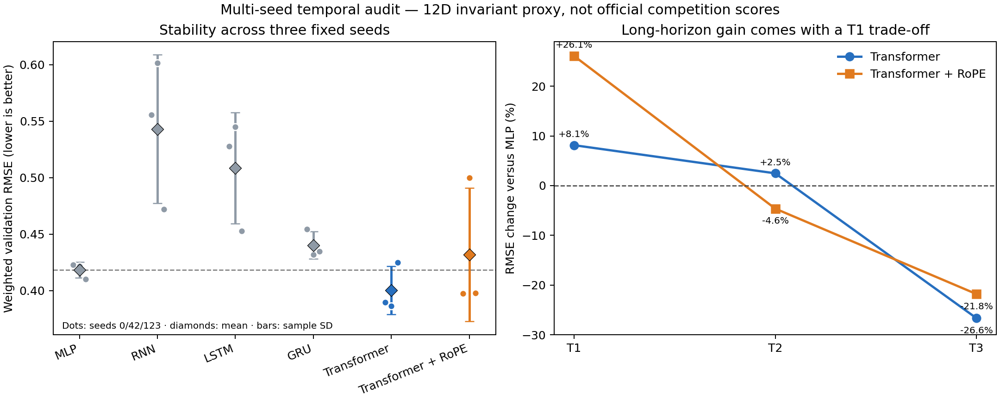

# 多随机种子时序架构与 RoPE 验证报告

## 结论先行

在预注册的固定 200 epoch、seeds `0/42/123`、不按验证集挑选 epoch 的协议下，普通 causal Transformer 是唯一通过本轮升级门槛的架构：方向权重代理 RMSE 为 `0.40032 ± 0.02126`，相对 MLP 的 `0.41815 ± 0.00697` 平均改善 `4.26%`，3 个种子中 2 个获胜；T3 平均改善 `26.65%`。它因此获得“进入三维等变模型小规模试验”的资格，但**不能替换当前 NeuralMD 初赛基线**。

RoPE Transformer 的平均 RMSE 为 `0.43167 ± 0.05897`，虽然 3 个种子中也有 2 个优于各自 MLP，但 seed 42 明显失稳，平均结果反而比 MLP 差 `3.23%`，判定 **no-go**。LSTM/RNN/GRU 在相同预算下均未显示整体优势。

## 实验协议

- 数据：仅官方方向二的 80 个训练复合物和 10 个验证复合物；未访问 internal test。
- 输入：从轨迹提取的 12 维刚体运动不变量，仅用于低成本架构筛选。
- 模型预算：全部低于 10k 参数；普通 Transformer 与 RoPE Transformer 均为 4,860 参数。
- 训练：固定 200 epoch，batch size 16，seeds `0/42/123`，最终 epoch 比较。
- 加权代理：`0.5 × T1 + 0.3 × T2 + 0.2 × T3`；数值不是官方 Geo/Phys/Dyn/Stab 总分。
- 预注册：`configs/temporal_multiseed_rope_preregistration.json`，在结果产生前已提交 commit `cd951d2`。

## 代码审计修正

旧的 invariant screen 在计算 Static 对照时，把最后一个观测时刻的非零“步长特征”重复到未来。物理静态轨迹的未来步长应为零。本轮将物理零值按训练集统计量标准化后作为 Static 的未来步长特征。该修正只影响 Static 对照，不影响 MLP、RNN、LSTM、GRU 和 Transformer 之间的排序。

RoPE 使用每个注意力头内部的旋转位置编码，并保持与普通 Transformer 相同的隐藏宽度、层数、头数和参数量；因而本轮是可解释的单变量对照。

## 主要结果

| 架构 | 参数量 | 加权 RMSE，均值 ± 样本标准差 | 对 MLP 配对差值 | 胜过 MLP 的种子数 | 决策 |
|---|---:|---:|---:|---:|---|
| MLP | 5,772 | 0.41815 ± 0.00697 | 0 | — | 参照 |
| RNN | 5,916 | 0.54302 ± 0.06570 | +0.12488 | 0/3 | no-go |
| LSTM | 5,412 | 0.50844 ± 0.04905 | +0.09029 | 0/3 | no-go |
| GRU | 5,584 | 0.44023 ± 0.01219 | +0.02209 | 0/3 | no-go |
| Causal Transformer | 4,860 | **0.40032 ± 0.02126** | **-0.01783** | 2/3 | 进入 3D pilot |
| Transformer + RoPE | 4,860 | 0.43167 ± 0.05897 | +0.01353 | 2/3 | no-go |

| 架构 | T1 RMSE | T2 RMSE | T3 RMSE | 相对 MLP 的 T1/T2/T3 变化 |
|---|---:|---:|---:|---:|
| MLP | 0.36171 | 0.35140 | 0.65935 | 参照 |
| Causal Transformer | 0.39112 | 0.36010 | **0.48363** | `+8.13% / +2.48% / -26.65%` |
| Transformer + RoPE | 0.45602 | **0.33514** | 0.51560 | `+26.08% / -4.63% / -21.80%` |

负百分比表示误差改善。普通 Transformer 的收益集中在 T3，T1 明显回退；这支持“长时序注意力确有信号”，但也说明比赛权重最高的 T1 需要短记忆路径或场景自适应门控保护。

## 决策与下一步

1. 保留普通 causal Transformer，作为后续等变时空模型的 temporal block 候选。
2. 暂停当前 RoPE 配置，不进行事后调参；如未来重启，必须单独预注册频率尺度或归一化改动。
3. 不继续扩大 RNN/LSTM/GRU 预算。它们可作为负结果写入科研过程，证明“长序列”不等于循环网络在小数据上自然占优。
4. 下一轮只做两个可归因试验：训练态小噪声增强，以及“等变空间编码器 + causal attention”的三维 feasibility pilot。
5. 任何三维模型必须回到 Geo/Phys/Dyn/Stab 与 T1/T2/T3 验证；12D proxy 结果不能当作官方得分或最终模型性能。

## 可复核产物

- 原始逐 seed 结果：`reports/reproduction/temporal_multiseed_rope_val.json`
- 预注册配置：`configs/temporal_multiseed_rope_preregistration.json`
- 训练入口：`scripts/train_temporal_multiseed_rope.py`
- 绘图入口：`scripts/plot_temporal_multiseed_rope.py`
- 模型实现：`protein_quanta/temporal_models.py`
