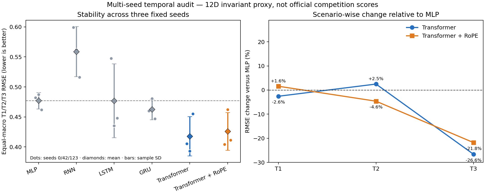

# 新版协议长序列架构与 RoPE 多随机种子实验

## 协议与证据边界

本次实验使用新版指导手册的 T1 `10→10`、T2 `80→20`、T3 `20→80`，在 MISATO-100 的 80 个训练复合物和 10 个验证复合物上比较 MLP、RNN、LSTM、GRU、causal Transformer 与 Transformer+RoPE。所有模型固定训练 200 epoch，采用 seeds `0/42/123`，不按 validation 选择 epoch，未访问 internal test。

输入是 12 维 SE(3) 不变轨迹特征，因此这里只能证明时间建模机制的可行性，不能替代原子坐标层面的 Geo/Phys/Dyn/Stab 评价，也不是官方得分。

新版手册说明 T1–T3 的精确权重将在后续评测材料发布。原始运行文件保留了旧脚本的 `0.5/0.3/0.2` 历史字段，但本报告完全忽略该字段，统一使用三场景等权宏平均。汇总由固定脚本从逐场景原始值重算，源 JSON SHA256 为 `040a0b48914ff12a7dcf02131b8975edc58f884e595dc914ca489b98c56c6767`。

## 结果

| 架构 | T1 RMSE | T2 RMSE | T3 RMSE | 等权宏平均 ± SD | 配对胜 MLP 种子数 | 预注册 gate |
|---|---:|---:|---:|---:|---:|---|
| MLP | 0.42046 | 0.35140 | 0.65935 | 0.47707 ± 0.01361 | — | 对照 |
| RNN | 0.44841 | 0.40296 | 0.82546 | 0.55895 ± 0.04162 | 0/3 | no-go |
| LSTM | 0.42065 | 0.36685 | 0.64327 | 0.47692 ± 0.06155 | 2/3 | no-go |
| GRU | 0.41390 | 0.33980 | 0.63379 | 0.46250 ± 0.01695 | 3/3 | no-go |
| Transformer | **0.40961** | 0.36010 | **0.48363** | **0.41778 ± 0.03279** | 3/3 | **pass** |
| Transformer + RoPE | 0.42705 | **0.33514** | 0.51560 | 0.42593 ± 0.03160 | 3/3 | **pass** |

相对 MLP，普通 Transformer 的等权宏平均改善 `12.43%`，T1 改善 `2.58%`，T3 改善 `26.65%`，但 T2 恶化 `2.47%`。RoPE 版本宏平均改善 `10.72%`，T2/T3 分别改善 `4.63%/21.80%`，但 T1 恶化 `1.57%`。RoPE 没有超过普通 Transformer，说明“旋转位置编码必然更适合本任务”的假设不成立；它只呈现了不同的时间尺度偏好。

## 决策

1. **普通 causal Transformer 是当前时间机制主线。** 它在三个随机种子上均胜过配对 MLP，并且在新版 T1 下不再出现原旧协议中的短程代价。
2. **RoPE 保留为消融，不作为默认改进。** 它对 T2 有利，但宏平均和 T1/T3 均逊于绝对正弦位置编码。
3. **GRU 作为低算力备份。** 三个种子均胜 MLP，但长期改善不足 5%，未通过完整 gate。
4. **不将代理结果直接移植成获胜声明。** 下一阶段必须在 semi-flexible 原子坐标模型上结合蛋白固定、配体等变空间表示，并同时检查 Phys、Dyn 和 Stab，防止仅优化低维统计。

## 可复核产物

- 原始运行：`temporal_multiseed_rope_updated_guide_val.json`
- 等权汇总：`temporal_multiseed_rope_updated_guide_summary.json`
- 分析附录：`configs/temporal_multiseed_updated_guide_analysis_addendum.json`
- 重算入口：`scripts/summarize_updated_temporal_results.py`
