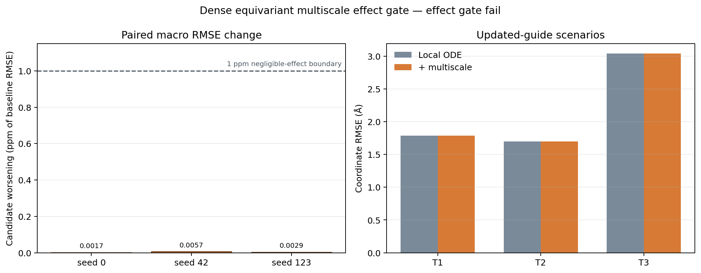

# 严格等变多时间尺度三维动力学：64/16 三种子效应闸门

> 结论：**no-go，不晋升为初赛性能候选。** 本实验是 MISATO-100 官方 train 内部 64/16 机制验证，不是完整 MISATO 训练、官方 validation/test 结果或比赛分数。

## 技术摘要

严格 E(3) 等变的 8,930 参数 dense 径向场解决了 NeuralMD pilot 中的旋转误差，并在三个随机种子、两组各 50 epoch 的训练中保持完全有限、零梯度裁剪和零极端键长事件。然而，加入权重 `0.25` 的 `[5,10,20,40]` 多时间尺度 Smooth-L1 后，16-complex 冻结留出集的三场景等权坐标 RMSE 从 `2.1768000312 Å` 变为 `2.1768000387 Å`，相对变化为 `−3.42×10⁻⁹`（负号表示恶化）。三个 seed 均未获胜，差异只有 `3.7×10⁻⁹–1.24×10⁻⁸ Å`，远低于预注册的 `10⁻⁶` 相对“数值可忽略”界限。

这不是“创新损失未接入”的假阴性：三个 seed 的候选—控制参数 L2 分别为 `0.04874/0.06489/0.04416`。更合理的诊断是最小等变场形成了近静态解：T1/T2/T3 的预测步幅仅为真值的约 `0.87%/0.98%/0.97%`。多尺度监督虽改变参数，却没有恢复动力学振幅。因此停止本实验族，不据留出结果调系数或阈值。

图左以 ppm 展示每个 seed 的候选宏 RMSE 恶化量；虚线是 1 ppm（即预注册 `10⁻⁶` 相对差）可忽略边界，三根柱均低于 `0.006 ppm`。图右从零开始展示三场景绝对 RMSE，两组柱形重合正是“无可辨效应”，没有使用截断坐标放大差异。

## 三场景结果几乎完全重合

以下均为 16 个冻结 train-holdout 复合物、三个 seed 的无权平均。误差类越低越好，contact agreement 越高越好。

| 场景 | 指标 | Local ODE | + multiscale | 候选相对变化 |
|---|---|---:|---:|---:|
| T1 10→10 | coordinate RMSE (Å) | 1.7896313655 | 1.7896313568 | −0.000000486% |
| T2 80→20 | coordinate RMSE (Å) | 1.6985081310 | 1.6985081347 | +0.000000219% |
| T3 20→80 | coordinate RMSE (Å) | 3.0422605971 | 3.0422606245 | +0.000000898% |
| T3 | RMSE slope (Å/frame) | 0.0376736509 | 0.0376736526 | +0.000004334% |
| T3 | RMSF MAE (Å) | 3.2339548804 | 3.2339548171 | −0.000001958% |
| T3 | Rg MAE (Å) | 0.1345165539 | 0.1345166500 | +0.000071427% |
| T3 | contact agreement | 0.9712082060 | 0.9712082060 | 0 |
| 三场景宏平均 | bond-length MAE (Å) | 0.0384879493 | 0.0384879601 | +0.000028206% |
| 三场景宏平均 | extreme bond event | 0% | 0% | 0 pp |

T3 只有 RMSF MAE 按严格不等式出现极微小改善，Rg 与 contact 未改善，未达到预注册“3 项中至少 2 项改善”。该 RMSF 差异也远低于数值可解释尺度，不能单独作为正面结果。

## 预注册闸门：效果失败，安全通过

| 闸门 | 结果 | 判定 |
|---|---:|---|
| 宏 coordinate RMSE 改善 | −3.42×10⁻⁹ relative | 失败 |
| 至少 2/3 paired seed 胜出 | 0/3 | 失败 |
| T3 coordinate RMSE 至少改善 3% | −0.000000898% | 失败 |
| T3 RMSE slope 至少改善 5% | −0.000004334% | 失败 |
| T3 的 RMSF/Rg/contact 至少两项改善 | 1/3 | 失败 |
| T1 coordinate 回退不超过 2% | 实际轻微改善 | 通过 |
| bond MAE 回退不超过 5% | +0.000028206% | 通过 |
| extreme event 增量不超过 0.05 pp | 0 pp | 通过 |
| 所有 rollout 有限 | non-finite fraction = 0 | 通过 |

因此结果是“**实现与安全可行，预测效果无效**”，而不是综合提升。

## 数据、场景与实验设计

- 数据：MISATO-100 官方 train 中 80 个复合物，通过 salted SHA-256 确定性分为 64 development / 16 holdout；样本互斥，但未按蛋白同源或配体 scaffold 分组。
- 场景：新版手册 T1 为观察 0–9、预测 10–19；T2 为观察 0–79、预测 80–99；T3 为观察 0–19、预测 20–99。
- 初始化：每个场景只用最后两帧观测估计状态，不使用目标帧速度。
- 对照：相同模型初始化、样本顺序、局部窗口和多尺度窗口。控制为 local ODE MSE；候选为 local ODE MSE + `0.25 ×` multiscale Smooth-L1。
- 训练：seeds `0/42/123`，每臂 50 epoch，Adam `1e-4`，Euler step `0.025`，final epoch only；不按 holdout 选择 checkpoint。
- 物理诊断：16/16 holdout 都有通过首帧几何顺序匹配的 RCSB PDB 显式 `CONECT` 键图，不按距离猜键。
- 聚合：因新版手册未公开 T1/T2/T3 精确权重，使用等权宏平均，不伪造官方总分。

## 留出隔离与鲁棒性验证

训练入口不接受 holdout 参数。只有三份 `training_complete_holdout_unread` 清单、六份 final checkpoint 全部存在且 SHA-256 与清单一致，评估入口才读取 holdout ID、拓扑和 MISATO 目标轨迹。实际时序为：seed 123 于 `2026-08-13T18:29:58Z` 封存，随后评估才开始。

首次评估完成数值计算后，因 NumPy Boolean 无法被标准 JSON 编码而在落盘阶段失败。修复严格限定为 NumPy scalar `.item()` 序列化适配器；模型、检查点、数据、指标和阈值均未改变。热修复后对同一六检查点重评估，并用独立纯汇总模块从逐 seed 结果复算，最终 gate 对象逐字段完全一致。原始报告 SHA-256 为 `c6f0a388c12d501bd45ccbaa7f73f683244dc355954e0ed7216aa1504b631fc7`。

| Seed | 每臂 epoch | Control/Candidate clipped | Control/Candidate non-finite | Candidate vs control 参数 L2 |
|---:|---:|---:|---:|---:|
| 0 | 50 | 0 / 0 | 0 / 0 | 0.04874384 |
| 42 | 50 | 0 / 0 | 0 / 0 | 0.06489188 |
| 123 | 50 | 0 / 0 | 0 / 0 | 0.04415745 |

## 科研解释与边界

1. **严格等变只是必要条件，不是充分条件。** dense 径向场把共同刚体变换误差降到 `8.58×10⁻⁶ Å`，但空间正确性没有自动带来时间动力学。
2. **新增损失真实影响了优化，但未影响可观测轨迹。** 三 seed 的参数差异明显，而预测差异低于 `10⁻⁶` 相对尺度，说明当前模型存在输出不敏感或近静态吸引域，不应继续把问题归因于损失未接入。
3. **主要瓶颈是动力学振幅。** 控制与候选的 step-amplitude ratio 都约为 `0.009`，即只恢复真值约 1% 的逐帧位移。这和先前 NeuralMD/epoch-5 的欠动力学现象方向一致，但本最小模型更严重。
4. **不能外推到完整模型。** 该结果只否定“8,930 参数 dense 严格等变场上直接叠加固定权重多尺度损失即可产生收益”，不否定多尺度目标在更强时空等变模型、预训练 encoder 或概率动力学中的价值。
5. **统计独立性有限。** 64/16 是样本互斥而非同源/scaffold 分组，且所有样本来自 MISATO-100；结果只足以做机制筛选。

## 决策与下一阶段

本实验族冻结为 no-go：不扫描 `λ`、不放宽 3%/5% 阈值、不据 holdout 选择 epoch，也不进入官方 validation/test。

1. 在 development 上建立 **step-amplitude recovery gate**：预测/真值步幅比例必须显著高于当前约 1%，同时保持严格 E(3) 与 bond safety；不通过则不做长程效应实验。
2. 升级模型表达而非微调损失：显式编码速度与时间、局部稀疏多层相互作用、角度/高阶几何，并评估 PaiNN/NequIP/EPT 类结构 encoder 的合规迁移；预训练权重仍须先做训练 ID、同源与配体泄漏审计。
3. 将已在 12 维 proxy 中通过的 causal temporal / multiscale 机制接到更强等变空间编码器，而不是继续扩展当前 dense 最小场。
4. 完整 MISATO 下载完成并通过精确字节数、官方 MD5、HDF5、split 与有限坐标审计后，再决定全量基线训练；下载未验收前不宣称全量结果。

## 证据入口

- 原始逐样本/逐 seed 报告：`evidence/dense-equivariant-effect-gate.json`
- 自动紧凑摘要：`evidence/dense-equivariant-effect-summary.json`
- 三份训练清单：`evidence/dense-equivariant-effect-seed-{0,42,123}.json`
- 启动前运行身份：`evidence/dense-equivariant-effect-run-manifest.json`
- 训练流水线与重评估日志：`evidence/dense-equivariant-effect-pipeline.log`、`evidence/dense-equivariant-effect-evaluation-rerun.log`
- 预注册配置：`configs/dense_equivariant_64_16_effect_gate.json`
- 正确性 pilot：`2026-08-14-dense-equivariant-correctness-pilot.md`
