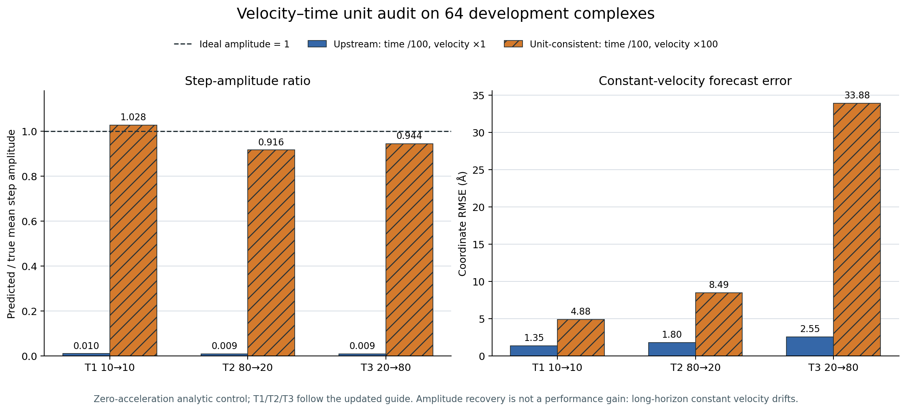

# 速度—时间单位一致性审计：近静态现象的机制定位

> 结论：**解析正确性 gate 通过，但恒速性能 gate 不存在。** 单位一致初始化把三场景步幅从约 `1%` 恢复到 `92%–103%`，同时把长程 T3 坐标 RMSE 推高到 `33.88 Å`。因此它证明了旧实验的近静态主要受数值单位约定影响，也证明“只把速度乘 100”不是可提交模型。

## 为什么启动这项审计

冻结的 dense 三种子效应实验在 T1/T2/T3 上均出现约 `0.009` 的 step-amplitude ratio。代码审计发现，rollout 将帧编号除以 `NeuralMD_scaling=100` 作为 ODE 时间，却直接用相邻帧坐标差作为初速度。若每帧间隔在原时间中为 1，则对缩放时间 `τ=t/100` 应满足 `dx/dτ=100·dx/dt`；否则零加速度下第一步只能前进观测位移的 `1/100`。

上游 NeuralMD 多轨迹代码确实采用了时间 `/scaling` 与帧差 `×1` 的组合，已发布 checkpoint 也不含独立速度初始化网络。因此旧实验仍是对上游约定的真实复现，不是代码接线错误；但对只有 8,930 参数的最小加速度场而言，这一约定构成严重的数值条件，不能再把近静态唯一归因于模型容量。

## 预注册协议

- 数据：MISATO-100 官方 train 内冻结的 64 个 development 复合物；不读取已解封的 16-complex holdout，不访问官方 validation/test。
- 模型：零加速度解析控制，不含训练参数。
- 上游约定：ODE 时间 `/100`，相邻帧差 `×1`。
- 单位一致约定：ODE 时间 `/100`，相邻帧差 `×100`。
- 场景：新版指导手册 T1 10→10、T2 80→20、T3 20→80；每个场景只用最后两个观测帧初始化。
- gate：单位一致版本第二初始化帧 RMSE ≤ `10⁻⁵ Å`，步幅比在 `[0.25,4]`，且初始化误差严格低于上游约定。

## 结果

| 协议 | 场景 | 第二初始化帧 RMSE (Å) | 预测步幅/真实步幅 | 未来坐标 RMSE (Å) |
|---|---|---:|---:|---:|
| 上游约定 | T1 | 0.690153 | 0.010276 | 1.3540 |
| 上游约定 | T2 | 0.646479 | 0.009163 | 1.8043 |
| 上游约定 | T3 | 0.712492 | 0.009440 | 2.5497 |
| 单位一致 | T1 | 5.52×10⁻⁸ | 1.027587 | 4.8828 |
| 单位一致 | T2 | 3.63×10⁻⁸ | 0.916331 | 8.4893 |
| 单位一致 | T3 | 5.62×10⁻⁸ | 0.943994 | 33.8846 |

九项预注册检查全部通过。解析结果把因果链拆开了：`×100` 几乎精确恢复第二个观测帧并恢复正确运动量级；但真实轨迹会改变方向和速度，未经学习的恒速递推随 horizon 快速漂移。因此下一模型必须同时满足“振幅非塌缩”和“学会加速度/抗漂移”，不能用静态或恒速低阶基线的单一 RMSE 掩盖动力学错误。

## 对旧证据的更正边界

1. 原三种子结果、检查点哈希和 no-go 决策不删除；它们严格否定的是旧缩放协议下直接叠加多尺度损失。
2. 不再声称该结果一般性否定多尺度三维动力学，也不再把近静态唯一归因于模型表达能力。
3. 已解封 16-complex holdout 不用于选择新的时间参数化、加速度尺度或损失权重。
4. 新实验先在 development 子集配对比较上游参数化与帧时间参数化。对单位一致关系，`time /100 + velocity ×100 + acceleration ×10000` 与 `time ×1 + velocity ×1 + acceleration ×1` 在连续方程中等价；后者避免巨大导数量级，作为下一步数值实现。

## 可复核证据

- 预注册：`configs/velocity_time_consistency_audit.json`
- 原始逐复合物结果：`reports/reproduction/evidence/velocity-time-consistency-development64.json`
- 原始 JSON SHA-256：`3318c48bb1dd6017b52b1c78c8322f115a58ea468e480e21f4e018d49923f5e9`
- 冻结 split manifest SHA-256：`0abdf4921817cdf48d65e5552252bf0fe6b49f85a51f9296d89ada95d32fa86d`
- 解析回归测试：`tests/test_neuralmd_multiscale.py`
